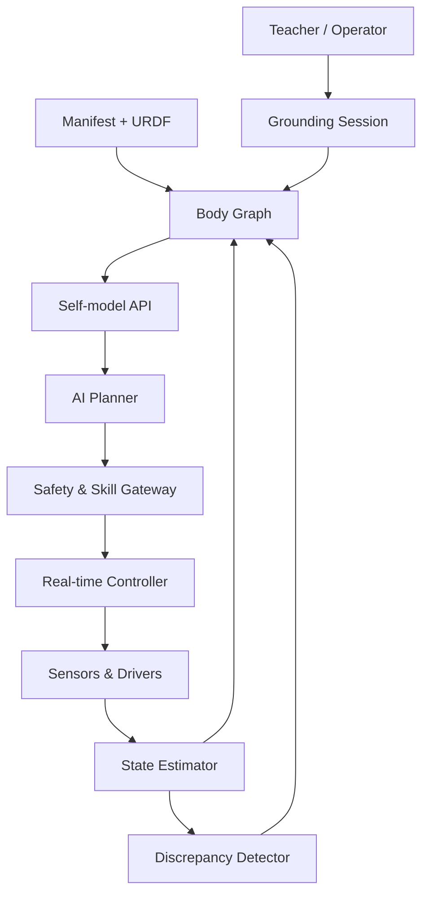

# this-is-yourX

> Teach an embodied AI: **this is your X** — your camera, joint, hand, wheel, battery, tool, or software organ.

`this-is-yourX` 是一個「機器自我模型（robot self-model / body schema）」專案。它讓 AI 不只知道機器人的零件名稱，還能把語言、幾何位置、感測值、控制介面、能力、安全限制與實際動作結果連成同一個可查詢、可驗證的模型。

例如，系統應能回答並驗證：

- 「這是你的左手」：`left_hand` 在身體樹的位置、相機中的區域及其父子關係。
- 「你的左手現在怎麼了？」：角度、速度、負載、溫度、健康度與資料新鮮度。
- 「左手能做什麼？」：可執行 skill、工作空間、負載與禁止動作。
- 「抬起左手會發生什麼？」：在執行前預測姿態與碰撞風險；執行後比對預測與觀測。
- 「這還是你的手嗎？」：元件更換、斷線、重新校正或裝上新工具後，更新身份與置信度。

本專案所說的「認知自己」是可工程驗證的 **embodiment grounding**，不等同於意識、自我意識或人格宣稱。

## 專案目標

建立一個跨機器人平台的 self-model layer，使 AI 可以：

1. **辨識（Identify）**：列出自身元件、名稱、別名、類別及從屬關係。
2. **定位（Locate）**：在 TF/3D 模型及相機畫面中指出元件。
3. **感知（Sense）**：讀取元件狀態，知道資料來源、時間與可信度。
4. **理解能力（Affordance）**：知道元件能做什麼、需要什麼條件、有哪些限制。
5. **預測（Predict）**：估計命令會造成的自身狀態與外界變化。
6. **控制（Act safely）**：只透過具權限、限幅、可中止的 skill 執行動作。
7. **自我檢查（Diagnose）**：察覺命令、感測、視覺與模型之間的不一致。
8. **適應（Adapt）**：元件替換或掛載新工具後，重新建立身份及校正關係。

## 核心觀念：X 不是一個名稱，而是一份可驗證契約

每個 `X` 至少包含：

| 面向 | 內容 | 例：`left_hand` |
|---|---|---|
| 身份 | 穩定 ID、名稱、別名、版本 | `arm.left.hand` / 左手 |
| 結構 | parent/child、frame、幾何 | 接在 `left_wrist` |
| 感測 | topic/API、單位、更新率、時戳 | 位置、電流、觸覺 |
| 動作 | 可用 skill 與參數 | `open_gripper` |
| 能力 | 可抓取重量、工作空間 | 夾持 0–300 g |
| 限制 | 軟硬限位、速度、溫度 | 溫度超標禁止動作 |
| 安全狀態 | 失效時的可預期行為 | 釋放扭力或保持 |
| 證據 | 為何認定它是此元件 | manifest、TF、視覺、wiggle test |
| 置信度 | 身份/狀態可信程度 | `0.98`，資料 20 ms 前 |

## 建議的第一個 MVP

先做一個桌上型 **2-DOF 手臂／指向器**，不要一開始就做人形機器人。

- 兩顆可回讀位置、電流與溫度的 smart servo，分別命名為 `shoulder`、`elbow`。
- 末端裝一個 `hand`（簡單夾爪或指示棒）與接觸感測器。
- 一台固定 RGB-D 或 RGB 相機觀察整個裝置。
- Linux 主機執行 ROS 2、自我模型服務、視覺與 AI；MCU/馬達控制板處理即時控制。
- 使用者以語音或 UI 教學：「這是你的左手」，並指向或觸碰元件。

MVP 的通過條件：AI 能正確列出三個元件、在影像與 TF 中定位、執行安全小幅度 `wiggle` 確認對應關節、回報狀態、拒絕超限命令，且拔除感測器後 1 秒內進入 degraded/fault 狀態。

## 系統概觀



**重要邊界：LLM/VLM 不直接寫馬達命令。** AI 只能提出結構化 skill request；Safety & Skill Gateway 檢查權限、狀態、限位、碰撞、速度與 E-stop 後，才交給確定性控制器執行。

## 文件導覽

| 文件 | 用途 |
|---|---|
| [專案願景與範圍](docs/00_PROJECT_VISION.md) | 定義問題、術語、非目標與成功層級 |
| [系統架構](docs/01_SYSTEM_ARCHITECTURE.md) | 元件、資料流、部署與關鍵設計原則 |
| [實現方案](docs/02_IMPLEMENTATION_OPTIONS.md) | 模擬、桌上型、機械臂與移動機器人方案比較 |
| [軟硬體規格](docs/03_HARDWARE_SOFTWARE.md) | 建議 BOM、運算、感測、致動、軟體棧 |
| [資料模型與 API](docs/04_DATA_MODEL_AND_APIS.md) | manifest、狀態、事件、ROS 介面與 skill contract |
| [實驗與驗收](docs/05_EXPERIMENTS_AND_ACCEPTANCE.md) | 測試案例、指標與 Definition of Done |
| [開發路線圖](docs/06_ROADMAP.md) | 由模擬到實機的階段、交付物與 gate |
| [安全、資安與隱私](docs/07_SAFETY_SECURITY_PRIVACY.md) | 硬體安全、AI 權限、紀錄與資料治理 |
| [協作方式與待決策項目](docs/08_COLLABORATION.md) | George 可協助的項目、issue/PR 規則 |
| [AI Agent 整合](docs/09_AI_AGENT_INTEGRATION.md) | Tools、prompt、model routing 與 agent evaluation |
| [名詞表](docs/10_GLOSSARY.md) | self-model、grounding、evidence 等詞彙 |
| [S1 實機建置計畫](docs/11_S1_BUILD_PLAN.md) | 原 2-DOF 本地視覺方案；目前保留為 fallback |
| [開發歷史與目前 S1 決策](docs/HISTORY.md) | Amazing Hand 採購、Webcam、影像模型、資料與驗收計畫 |
| [技術參考](docs/REFERENCES.md) | 官方文件與版本選擇依據 |

另有可直接機器驗證的範例：

- [`examples/body-manifest.example.yaml`](examples/body-manifest.example.yaml)
- [`schemas/component.schema.json`](schemas/component.schema.json)

## 建議軟體基線（2026-09）

- 穩定實機基線：Ubuntu 24.04 + ROS 2 Jazzy + Gazebo Harmonic。
- 新平台試驗線：Ubuntu 26.04 + ROS 2 Lyrical + Gazebo Jetty；待主要驅動與套件驗證後再升為預設。
- 結構與座標：URDF/Xacro、TF2、`robot_state_publisher`。
- 硬體抽象：`ros2_control`；運動規劃可選 MoveIt 2。
- 資料記錄：rosbag2 + metadata；訓練資料可另轉 Parquet/LeRobot dataset。
- AI：以 provider adapter 隔離雲端/本地 LLM、VLM 或 policy；控制安全不依賴模型遵從。

## 預計 repo 結構

```text
this-is-yourX/
├── docs/                 # 規格、架構、實驗、ADR
├── examples/             # 可執行的 manifest 與情境
├── schemas/              # JSON Schema / interface contracts
├── robot_description/    # URDF/Xacro、meshes、SRDF（後續）
├── self_model_core/      # body graph、state、evidence（後續）
├── grounding/            # 指認、視覺、wiggle test（後續）
├── skill_gateway/        # 安全 skill 執行（後續）
├── diagnostics/          # discrepancy/fault detector（後續）
├── simulation/           # Gazebo worlds、launch、tests（後續）
└── tests/                # schema、unit、integration、HIL（後續）
```

## 快速開始（目前階段）

目前 repo 是設計與規格階段。2026-09-03 已接受：新製實機、本地相機/本地推論、S1 預算，以及 Ubuntu 24.04 + ROS 2 Jazzy + Gazebo Harmonic 基線。同日實際 embodiment 由原 2-DOF 提案轉為已下單的 **Amazing Hand 右手版（4 指、8-DOF）**；原方案保留為 fallback。採購與視覺決策見 [開發歷史](docs/HISTORY.md)。

接下來：

1. 硬體到貨前建立 Amazing Hand 8-DOF semantic IDs、fake adapter、到貨檢查表及安全單軸 bring-up script。
2. 核對現有 Webcam 型號，準備固定支架、霧面背景、柔光燈及 ChArUco calibration board。
3. 到貨後先驗證8顆 servo identity、telemetry、timeout、torque-disable 與實體斷電路徑，不直接執行全幅多軸動作。
4. 先完成 marker/motion-based grounding，再以自訂 robot-hand keypoint model 建立自身視覺；VLM 不進安全控制鏈。
5. 所有實機主張必須附 experiment ID、hardware/software/calibration revision 與可重播 evidence。

## License

[MIT](LICENSE)
