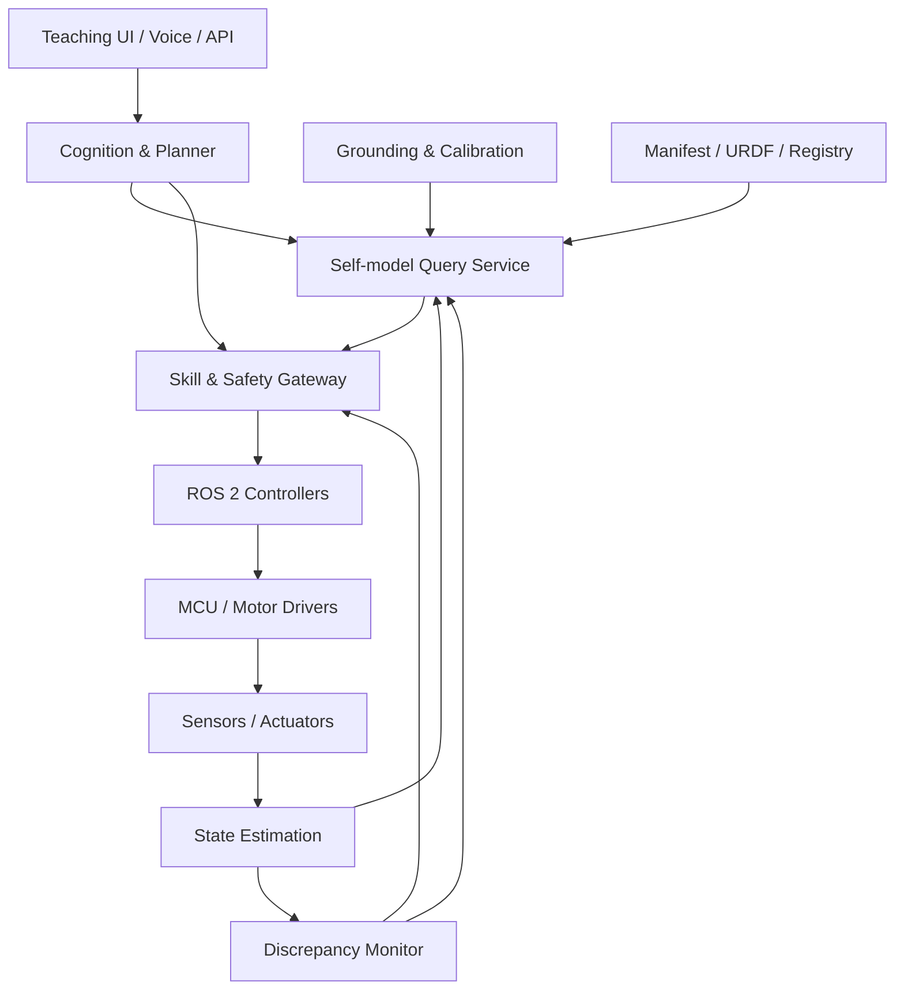
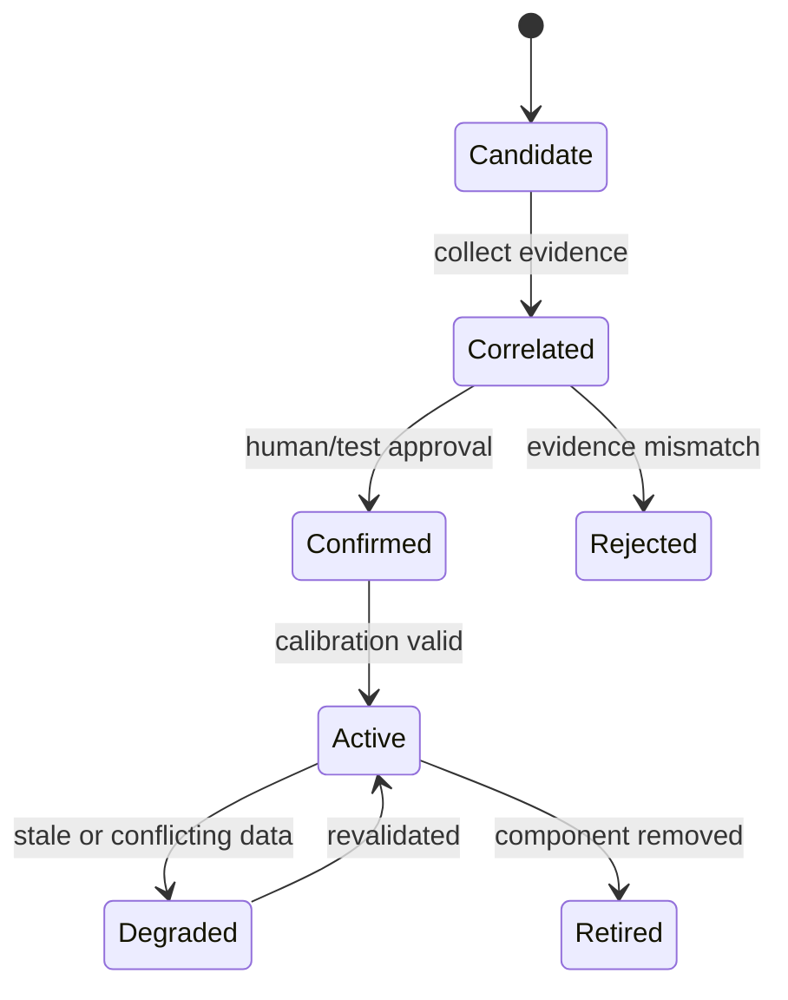

# 系統架構

## 1. 架構目標

Self-model 必須同時滿足兩種不同時間尺度：

- 馬達閉迴路、E-stop、watchdog 屬於毫秒級且必須確定性執行。
- 語言理解、影像 grounding、規劃與學習可在數十毫秒到數秒內完成。

因此系統採分層架構：高階 AI 可以查詢、提出意圖及解釋，但不能跨過安全層直接控制硬體。

## 2. 邏輯分層



### A. Physical & real-time layer

職責：讀取 encoder/IMU/touch/current、執行 position/velocity/torque controller、硬體限位、watchdog 與斷電安全。

原則：

- 硬限位與 E-stop 不依賴 ROS、網路或 AI。
- SBC 失聯時 MCU 必須在限定時間內進入 safe state。
- 高扭力系統的安全迴路應能切除 actuator power，運算主機可保持供電以記錄事故。

### B. Robot middleware layer

職責：driver、時間同步、TF、URDF、ros2_control、diagnostics、rosbag2、simulation bridge。

這一層將真實或模擬硬體轉成相同介面，避免 self-model 對特定廠牌 SDK 綁死。

### C. Self-model layer

核心是帶版本的 **Body Graph**：

- Node：component、sensor、actuator、software organ、attached tool。
- Edge：`part_of`、`connected_to`、`observes`、`actuates`、`powered_by`、`depends_on`。
- Dynamic state：position、health、freshness、confidence、active faults。
- Evidence：manifest、device identity、human label、visual match、actuation test。
- Capability：可提供的 observation 與允許的 skill。

建議服務拆分：

| 模組 | 主要責任 | 不負責 |
|---|---|---|
| `component_registry` | 載入 manifest、版本與唯一 ID | 即時感測 |
| `body_graph` | 查詢結構、關係、ownership | 直接控制 |
| `state_fuser` | 統一時戳、品質、狀態摘要 | 發明缺失數值 |
| `grounding_service` | 建立名稱/影像/硬體對應與證據 | 自動授權高風險動作 |
| `capability_registry` | 描述 skill、條件與資源 | 執行 skill |
| `discrepancy_monitor` | 預測與觀測比對、fault event | 擅自修改永久身份 |
| `self_model_api` | 提供結構化 query 與 explain | 把自然語言當資料庫主鍵 |

### D. Skill & safety layer

Planner 只能提出結構化 request，例如：

```yaml
skill: point_component
target_component: arm.left.hand
parameters:
  duration_s: 2.0
requested_by: operator.george
approval_token: null
```

Gateway 依序檢查：

1. 呼叫者身份與 role。
2. skill 是否存在且版本相容。
3. component 的 identity confidence 與 state freshness。
4. 前置條件、E-stop、fault、互斥資源。
5. 位置/速度/力矩/工作空間/碰撞限制。
6. 是否需要人在迴路及有效 approval。
7. 建立 execution ID、deadline 與 audit record。

執行器回傳 `accepted → running → succeeded/failed/cancelled`，每個狀態都可追溯。

### E. Cognition layer

可使用規則、LLM、VLM、policy 或混合式規劃。模型只處理：

- 將自然語言解析為 query 或 skill request。
- 根據 self-model 與世界狀態選擇既有 skill。
- 解釋元件狀態與故障證據。
- 提議新的 grounding/calibration 實驗，等待核准。

模型輸出必須經 schema 驗證；解析失敗、欄位缺失或引用未知元件時，一律不執行。

## 3. Canonical source 與衍生資料

避免 URDF、YAML、driver 與 AI 記憶彼此矛盾，需指定真實來源：

| 資料 | Canonical source | 衍生/快取 |
|---|---|---|
| 幾何與 joint tree | URDF/Xacro | TF、3D scene |
| 語意身份與能力 | body manifest | graph DB / cache |
| 硬體 serial/firmware | device registry | manifest binding revision |
| 即時狀態 | driver/sensor message | state summary |
| 安全限制 | versioned safety config + hardware limits | planner hints |
| 視覺 mask/keypoint | perception observation | grounding evidence |
| 自然語言名稱 | reviewed aliases | embeddings/search index |

AI 對話記憶不是 canonical source；它只能透過 API 讀取當下版本。

## 4. 三種模型並存

### 4.1 Declarative model

回答「有哪些元件、如何連接、能力與限制是什麼」。由 manifest、URDF、SRDF、driver configuration 構成。

### 4.2 Runtime state model

回答「現在如何」。所有值都有 `observed_at`、`received_at`、`quality`、`source`。衍生值要標明算法與輸入版本。

### 4.3 Predictive model

回答「若做 A，預期如何」。由三層逐步增加：

1. kinematic model：關節角 → link pose。
2. physics/simulation model：命令 → 動態、接觸與碰撞。
3. learned residual/forward model：補償摩擦、背隙、負載等差異。

不要一開始用神經網路取代已知幾何與安全限制。學習模型應輸出預測區間或 uncertainty，且不能覆蓋硬限制。

## 5. Grounding 工作流



一次 teaching session 建議保存：

- utterance/text：「這是你的左手」。
- 說話者與權限。
- 指向 ray、觸碰事件、影像 frame 或 UI selection。
- 候選元件與各自分數。
- 使用的 TF/URDF/manifest revision。
- 是否做過 wiggle test、結果與風險設定。
- 最終確認者、時間與撤銷方式。

## 6. 執行緒與故障邊界

建議至少隔離四個 process/domain：

1. `safety-controller`：最小依賴、最高優先級、無生成式 AI。
2. `robot-runtime`：drivers、ros2_control、TF、state estimator。
3. `self-model-services`：registry、graph、grounding、monitor。
4. `ai-runtime`：LLM/VLM/policy adapters，可被停止而不影響安全。

在大型平台可再將影像與資料記錄分機。模型服務 crash 時，既有低階 safe stop 仍然有效；網路斷線時，未完成的遠端 AI request 逾時取消。

## 7. 部署拓撲

### 最小桌上型

- MCU：motor loop、limit switch、watchdog。
- Raspberry Pi 5 / 小型 x86：ROS 2、self-model、簡單 vision。
- 開發工作站：訓練、RViz/Gazebo、大型 VLM；可離線。

### Edge AI

- Jetson：ROS 2、vision、local VLM/policy inference。
- MCU：控制與安全。
- NAS/工作站：資料集、訓練、artifact registry。

### 分散式大型機器人

- safety PLC/MCU：安全與 actuator power。
- 每個 limb controller：局部 control/diagnostic。
- robot computer：ROS graph、planning、self-model。
- AI server：可選，權限低於 safety gateway。

## 8. 可觀測性

至少記錄：

- manifest/URDF/software/model 的 revision hash。
- 所有 skill request、檢查結果、approval 與 execution state。
- 關鍵 joint/sensor state 與 fault transition。
- grounding evidence 與人工修正。
- 預測、實測、誤差及 threshold 版本。

每個執行應具有 `trace_id`，讓「AI 為何認為這是手」與「為何允許它動」可沿著同一條記錄追查。

## 9. 建議 package 邊界

```text
src/
├── this_is_yourx_interfaces/   # msg/srv/action，低頻變更
├── this_is_yourx_registry/     # manifest + schema + revisions
├── this_is_yourx_state/        # state adapter/fusion
├── this_is_yourx_grounding/    # teaching sessions/evidence
├── this_is_yourx_gateway/      # skills/policy/approval/audit
├── this_is_yourx_monitor/      # discrepancy/faults
├── this_is_yourx_ai_adapter/   # optional LLM/VLM adapters
└── this_is_yourx_bringup/      # launch/config/composition
```

介面 package 不應依賴 AI SDK；safety gateway 不應依賴特定 LLM provider；硬體 adapter 不應知道自然語言。
