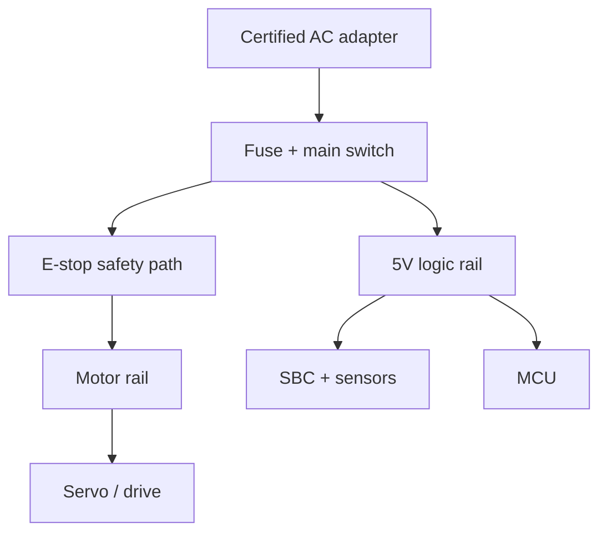

# 軟硬體規格與選型

> 本文件提供架構級建議，不把單一廠牌寫死。型號、價格與供貨會變動；採購前應以原廠資料、所需扭矩、供電與區域通路重新確認。

## 1. 建議基線

### 1.1 最小可行實機 BOM

| 子系統 | 建議規格 | 數量 | 用途 |
|---|---|---:|---|
| Robot host | Raspberry Pi 5 8/16GB 或小型 x86 Linux | 1 | ROS 2、self-model、UI、記錄 |
| 即時控制 | ESP32-S3 / STM32 / OpenCR 類控制板 | 1 | watchdog、I/O、低階控制 |
| Smart servo | 可回讀 position/current/temp 的 2 顆伺服 | 2 | shoulder、elbow |
| Servo interface | 原廠 USB/TTL/RS-485/CAN 介面 | 1 | host/controller 通訊 |
| Camera | USB RGB；預算允許可 RGB-D + IMU | 1 | 指認、link tracking、外部 ground truth |
| Touch | FSR、micro switch 或小 load cell | 1–3 | 人類觸碰教學、末端接觸 |
| Visual markers | AprilTag/ArUco 貼紙 | 1 組 | 初期 link identity ground truth |
| Power | 邏輯與馬達分離供電、保險絲、電流限制 | 1 組 | 降低 brownout 與事故影響 |
| Safety | 常閉 E-stop、motor-power relay/MOSFET、護罩 | 1 組 | 實體停止與夾傷防護 |
| Mechanical | 底座、兩段 link、固定件、線材應力釋放 | 1 組 | 安全、可重複幾何 |

### 1.2 推薦運算分工

| 計算工作 | 適合位置 | 理由 |
|---|---|---|
| 馬達電流/位置 loop、watchdog | MCU/servo drive | 不受 Linux 或模型延遲影響 |
| ROS drivers、TF、self-model | Robot Linux host | 介面一致、可記錄與部署 |
| tag/keypoint/小型 detector | Robot host 或智慧相機 | 低延遲、離線可用 |
| VLM/LLM | 開發工作站、Jetson 或雲端 adapter | 可更換，不進安全鏈 |
| policy training、模擬批次 | GPU 工作站 | 不壓縮實機安全資源 |

## 2. 運算平台

### Raspberry Pi 5

適合：MVP、ROS 2 nodes、tag detection、dashboard、rosbag2，以及小型量化模型。官方資料列出 2.4 GHz 四核心 Cortex-A76、USB 3、Gigabit Ethernet、相機介面與最高 16GB RAM。需要主動散熱；USB 相機與 servo interface 同時使用時要評估供電，最好以有源 USB hub 或相機獨立供電。

限制：沒有 NVIDIA CUDA；大型 VLM/VLA 不宜作為即時主工作負載。它仍可作 robot host，把模型推論送到另一台主機。

### Jetson Orin Nano Super 類 edge GPU

適合：多路影像、CUDA/TensorRT、本地 vision/policy inference。NVIDIA 公布的 Super 模式提供最高 67 sparse INT8 TOPS、8GB LPDDR5 與較高記憶體頻寬。8GB 對大型多模態模型仍有限，應先量測模型記憶體及延遲。

限制：功耗、散熱、軟體映像與 CUDA 相依性高於 Pi；仍需 MCU/drive 處理安全控制。

### x86 + discrete GPU

適合：開發、Gazebo、RViz、模型訓練、資料集處理及高階推論。若 robot 能接受有線網路，可先用既有電腦做 offboard compute，避免 MVP 初期先買 edge GPU。

### Mac 開發機

可用於文件、資料分析、模型實驗及部分模擬；正式 ROS 2 robot runtime 建議仍以官方 Tier 1 支援的 Ubuntu 組合為主。Apple Silicon 上可透過容器/VM 或原生工具做開發，但硬體驅動與即時 I/O 不應以它作唯一基線。

## 3. 致動器與控制

### 推薦 smart servo 特性

至少要求：

- 絕對或可重複歸零的 position feedback。
- 可設定 position/velocity/current limits。
- 可讀 voltage、temperature、hardware error；current/effort feedback 更佳。
- 支援 torque disable，通訊中斷有 watchdog 行為。
- 通訊協定與 SDK 可由 Linux/MCU 使用。

小型 2-DOF 可評估 ROBOTIS DYNAMIXEL XL/XC/XM 系列。小 link 優先低扭矩/低慣量型號；較長 link 或夾爪才升級 XM 類。不要只看 stall torque：需以連桿重量、重心距離、payload、加速度與至少 2–3 倍安全係數計算連續工作需求。

### 扭矩粗估

水平伸展時的靜態關節扭矩：

\[
\tau \approx \sum_i m_i g r_i
\]

再乘上加速、衝擊與設計裕量。stall torque 只代表短暫極限，不等於可長時間使用的額定扭矩。若計算接近型號極限，縮短 link、減輕末端或換大一級 actuator。

### MCU 與 host 的責任切分

MCU/drive：

- 100–1000 Hz 低階 loop（依 actuator/transport 能力）。
- limit switch、motor enable、watchdog、command timeout。
- 原始狀態採樣及單調時鐘 timestamp。
- 發生 fault 時直接進 safe state。

Linux host：

- 50–200 Hz ros2_control hardware interface。
- trajectory、kinematics、state fusion、logging。
- 不應用 Python/LLM loop 產生高頻直接控制。

## 4. 感測器

### 最低需求

1. 每個 joint 的 position feedback。
2. 一台能看見整個裝置的 RGB camera。
3. 可證明人類觸碰/末端接觸的離散或類比 sensor。
4. E-stop 與 motor-enable 狀態回讀。

### 推薦擴充

| 感測器 | 增加的 self-model 能力 | 注意事項 |
|---|---|---|
| RGB-D camera | link 3D 定位、碰撞、手眼校正 | USB 頻寬、反光/陽光、深度有效距離 |
| IMU | base/link 方向、碰撞/震動 | 安裝方向與 bias calibration |
| Motor current | 負載、卡住、接觸異常 | 不是精準 torque sensor，需校正 |
| FSR/touch | 「這裡被碰了」的教學證據 | 漂移、遲滯、閾值 |
| Load cell | 末端載重與接觸 | amplifier、機構力路徑、過載保護 |
| Microphone array | 口語教學與方向線索 | 隱私、噪音、不可當唯一指向證據 |
| Temperature/voltage | 健康與 power dependency | sample rate 可低，但需告警門檻 |

RGB-D 可評估 RealSense D4xx/D5xx 或 Luxonis OAK-D 類產品。OAK-D 可在相機端做部分 depth/AI；RealSense 有成熟 depth SDK 與 calibration 資料。實際選擇應先驗證 Linux/ROS driver、工作距離、USB/PoE、室內光線、同步需求及 2026 年當下供貨。

## 5. 電源與安全硬體

建議電源樹：



- E-stop 切 actuator energy，不只發一個軟體 topic。
- E-stop 狀態同時回報 MCU/ROS 以記錄；軟體不能繞過它。
- 馬達與 SBC 分 rail，避免 servo 瞬間電流造成 SBC reboot。
- 電壓、極性、線徑、接頭電流與保險絲都依實際 servo 規格計算。
- 可動線材需應力釋放，避免被 joint 捲入。
- 初期限制低電壓、低速度、小 link，並加透明護罩或保持安全距離。

## 6. 軟體棧

### 6.1 推薦穩定線

| 層 | 建議 | 說明 |
|---|---|---|
| OS | Ubuntu 24.04 LTS | ROS 2 Jazzy 官方 binary 基線 |
| Middleware | ROS 2 Jazzy | 成熟 LTS 生態 |
| Simulation | Gazebo Harmonic | Jazzy 官方推薦配對 |
| Robot model | URDF/Xacro + TF2 | 結構、frame、幾何 |
| Control | ros2_control | 模擬/實機硬體抽象 |
| Manipulation | MoveIt 2（選用） | IK、collision、trajectory |
| MCU bridge | vendor protocol 或 micro-ROS（選用） | 依 timing/transport 決定 |
| Data | rosbag2 + SQLite/MCAP；Parquet 衍生資料 | 原始可重播、分析有效率 |
| Core services | Python 3.12 起步，關鍵路徑 C++ | 先快迭代，再量測優化 |
| Schema | JSON Schema + YAML manifest | CI 可驗證 |
| ML | PyTorch / LeRobot（選用） | grounding、forward model、policy |
| Observability | ROS diagnostics + structured JSON logs | trace 與 fault |

截至 2026-09，ROS 2 Lyrical 是較新的 LTS，搭配 Ubuntu 26.04 與 Gazebo Jetty；但專案初期優先考量硬體 driver、MoveIt、相機 SDK 與社群套件成熟度，因此文件預設 Jazzy/Harmonic。建立 `lyrical` CI job，等所有必要套件通過再升級。

### 6.2 AI provider adapter

定義統一介面，而非把核心綁到單一模型：

```python
class CognitiveAdapter(Protocol):
    def parse_query(self, text: str, context: dict) -> dict: ...
    def propose_skill(self, goal: str, self_model: dict) -> dict: ...
    def summarize_evidence(self, evidence: list[dict]) -> str: ...
```

Adapter 可連本地模型、雲端 API 或 deterministic parser。輸出都必須通過 schema、policy 與 timeout；prompt 不具有硬體權限。

### 6.3 視覺成熟度階梯

1. Tag/marker：可靠 ground truth。
2. Hand-picked keypoints / color segmentation。
3. Robot link segmentation model。
4. Open-vocabulary detector/VLM proposal + geometry verification。
5. 多視角、遮擋、工具更換與 uncertainty calibration。

每一級都保留前一級作 regression oracle，不因加入 VLM 就刪除可解釋方法。

## 7. 儲存與資料生命週期

- `config/`：manifest、limits、calibration；Git versioned。
- rosbag2：原始同步 sensor/command/event；按 experiment ID 保存。
- metadata DB：session、operator、hardware/software revision、consent、結果。
- derived dataset：影像、state/action、labels；可由原始資料重建。
- model registry：模型 hash、訓練資料 revision、metric、部署狀態。

原始錄音/影像可能包含人員個資。預設 local-only、最短保留期、實驗前可見提示；上傳雲端需明確設定而非隱含行為。

## 8. 採購前 checklist

- [ ] 第一個 embodiment 與最大 payload 已確定。
- [ ] 每個 joint 的最壞情況扭矩已計算。
- [ ] servo 有 position feedback、torque-off 與通訊 timeout。
- [ ] Linux/ROS driver 可在目標 OS 測試。
- [ ] 相機工作距離、視角、同步與供電合適。
- [ ] power budget 含啟動/堵轉峰值，邏輯與馬達分離。
- [ ] E-stop 可實體切除 actuator power。
- [ ] 機構有限位、護罩與線材應力釋放。
- [ ] 所有零件都有 datasheet、接線圖與唯一 inventory record。
- [ ] 在訂購高價 GPU 前，已量測實際模型延遲與記憶體。

## 9. 三級預算策略（不含即時價格）

| 級別 | 建議配置 | 何時選 |
|---|---|---|
| S0：零新增硬體 | Gazebo + 現有電腦 | API、schema、fault test 尚未完成 |
| S1：桌上 MVP | Pi/x86 + 2 smart servos + RGB + touch + safety | 驗證真正 sensorimotor grounding |
| S2：AI/機械臂 | RGB-D + 4–6 DOF arm + edge GPU | S1 通過，開始 tool use/VLA |

先把 S0、S1 的成功門檻寫入 CI/HIL，能避免因追逐硬體規格而偏離研究問題。
