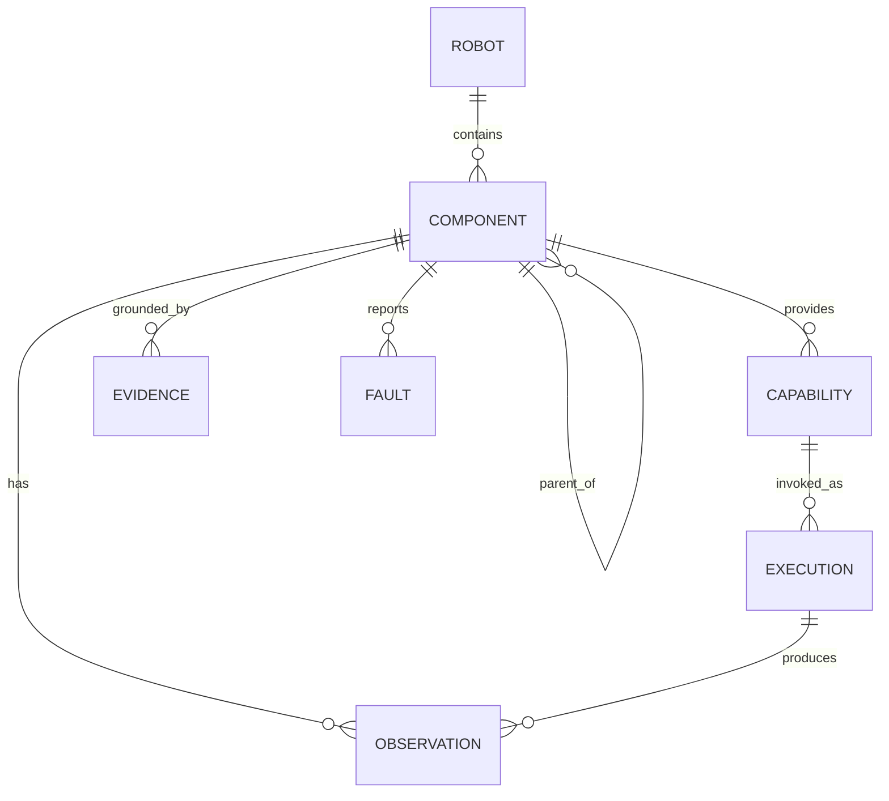

# 資料模型與 API

## 1. 設計目標

- 同一 component 在文件、ROS、資料集及 AI 回答中使用相同穩定 ID。
- 靜態宣告與動態狀態分離，避免頻繁狀態改寫 Git 設定。
- 每個 assertion 都能追到來源、時間、版本與 confidence。
- 模擬/實機只替換 adapter，不改 self-model API。
- 自然語言 alias 只是入口，不是主鍵。

## 2. 主要實體



### ComponentDefinition（靜態）

- `id`：穩定語意 ID，如 `arm.left.hand`。
- `kind`：link/joint/sensor/actuator/tool/power/software。
- `parent_id`：結構或功能上的 parent。
- `frame_id`：對應 TF frame。
- `aliases`：多語言名稱與 reviewed 狀態。
- `binding`：driver、device identity、topic/service。
- `limits`：位置、速度、effort、溫度、資料 freshness。
- `capabilities`：允許的 observation/skill。
- `safe_state`：fault/timeout 的行為。

### ComponentState（動態）

```json
{
  "component_id": "arm.left.elbow_joint",
  "observed_at": "2026-09-03T12:00:00.125Z",
  "received_at": "2026-09-03T12:00:00.133Z",
  "lifecycle": "active",
  "health": "ok",
  "values": {
    "position_rad": 0.41,
    "velocity_rad_s": 0.02,
    "current_a": 0.18,
    "temperature_c": 36.0
  },
  "quality": 0.99,
  "source": "ros:/joint_states",
  "binding_revision": "sha256:...",
  "active_faults": []
}
```

### Evidence

```json
{
  "evidence_id": "ev_01J...",
  "assertion": "visual_region corresponds_to arm.left.hand",
  "method": "supervised_wiggle",
  "session_id": "gs_01J...",
  "inputs": ["rosbag://exp-004#t=12.2", "manifest://rev/8"],
  "score": 0.97,
  "created_at": "2026-09-03T12:01:05Z",
  "confirmed_by": "operator.george",
  "expires_when": ["hardware_binding_changed", "calibration_changed"]
}
```

### Capability / SkillContract

```yaml
name: wiggle_joint
version: 1.0.0
target_kinds: [joint]
parameters:
  amplitude_rad: {type: number, minimum: 0.005, maximum: 0.052}
  cycles: {type: integer, minimum: 1, maximum: 3}
preconditions:
  - safety.estop == released
  - target.health == ok
  - target.state_age_ms < 100
  - workspace.people_detected == false
requires_approval: true
resources: [target.actuator_bus]
timeout_s: 5
cancel_behavior: controlled_stop
audit: full
```

## 3. ID 規則

- 使用小寫 dot-separated semantic path：`arm.left.elbow_joint`。
- 不把 serial number 放在 semantic ID；serial 放 `binding.device_identity`。
- 名稱改變不更改 ID；功能位置改變時建立 migration/redirect。
- 暫時 attachment 可用 `attachment.<mount>.<generated_id>`，確認後再給 reviewed alias。
- ROS frame/topic 可與 ID 不同，但 mapping 必須顯式。

## 4. Manifest 分層

建議三層覆寫，從共用到實機：

1. `model.yaml`：平台共用的語意、結構、能力。
2. `variant.yaml`：特定 BOM/型號與 limits。
3. `instance.yaml`：serial、校正、安裝方向、網路位置。

Instance 中的 secret（token/password）不得提交 Git；只放 secret reference。

合併規則必須 deterministic，輸出 canonical JSON 後計算 revision hash。啟動時將 hash 寫入每個 event/rosbag metadata。

## 5. ROS 2 介面草案

### Topics

| Topic | 型態（草案） | 說明 |
|---|---|---|
| `/self_model/component_states` | `ComponentState[]` | 低頻統一狀態摘要 |
| `/self_model/events` | `SelfModelEvent` | grounding/fault/attachment/revision |
| `/self_model/graph_revision` | `GraphRevision`（latched） | 當前 schema/manifest/URDF hash |
| `/safety/status` | `SafetyStatus`（latched） | E-stop、protective stop、mode |
| `/diagnostics` | standard diagnostic msgs | driver/system diagnostics |

原始高頻 joint/camera data 保留標準 ROS topic；不要複製全部資料到 self-model topic。

### Services

| Service | 輸入 | 輸出 |
|---|---|---|
| `ListComponents` | filter/kind/lifecycle | summaries + revision |
| `GetComponent` | semantic ID 或 alias | definition + current state + evidence |
| `ResolveAlias` | text/locale/context | candidates + scores，不能直接動作 |
| `LocateComponent` | ID + target frame/image | pose/ROI/mask + uncertainty |
| `ExplainAssertion` | assertion/event ID | evidence graph |
| `BeginGroundingSession` | teaching inputs | session ID/candidates |
| `ConfirmGrounding` | session/candidate/operator | new revision 或 rejection |

### Actions

| Action | 用途 |
|---|---|
| `ExecuteSkill` | 具 feedback/cancel 的安全技能執行 |
| `CalibrateComponent` | 可監看進度、中止與 rollback 的校正 |
| `RunIdentificationTest` | wiggle/flash/beep 等元件確認測試 |

## 6. HTTP/gRPC facade（非 ROS 客戶端）

可提供 read-mostly API：

```text
GET  /v1/self/components
GET  /v1/self/components/{id}
GET  /v1/self/components/{id}/state
GET  /v1/self/components/{id}/evidence
POST /v1/self/resolve
POST /v1/skills:execute
POST /v1/skills/{execution_id}:cancel
POST /v1/grounding/sessions
POST /v1/grounding/sessions/{id}:confirm
```

`POST /skills:execute` 需使用短效 capability token、idempotency key 與 caller identity。Web UI 不得直接連 actuator driver。

## 7. Query 與回答契約

自然語言問題先解析成只讀 query：

```json
{
  "intent": "get_component_state",
  "component_ref": "左手",
  "fields": ["health", "pose", "active_faults"],
  "at": "latest"
}
```

Resolve 結果如有多個候選：

```json
{
  "status": "ambiguous",
  "candidates": [
    {"id": "arm.left.hand", "score": 0.72},
    {"id": "arm.right.hand", "score": 0.21}
  ],
  "required_action": "ask_user"
}
```

模型不得自行把 ambiguity 變成確定答案。對人回答時至少顯示：結論、資料時間、health/fault、主要證據與置信度；必要時附「無法確認」。

## 8. 狀態新鮮度與三值邏輯

安全條件不要只用 true/false，而使用 `true / false / unknown`：

- `true`：資料在 freshness window 且條件成立。
- `false`：可靠資料顯示不成立。
- `unknown`：資料缺失、過期、衝突或來源失效。

動作 precondition 出現 `false` 或 `unknown` 都拒絕。只讀回答可顯示 unknown 並指出缺少哪個來源。

## 9. 事件模型

事件至少包含：

```json
{
  "event_id": "evt_01J...",
  "type": "prediction_mismatch",
  "severity": "warning",
  "component_ids": ["arm.left.elbow_joint"],
  "observed_at": "2026-09-03T12:03:01Z",
  "trace_id": "trace_...",
  "expected": {"delta_position_rad": 0.052},
  "actual": {"delta_position_rad": 0.004},
  "threshold_revision": "git:abc123",
  "recommended_state": "degraded"
}
```

Event 不可被 LLM 改寫；自然語言摘要與原始 event 分開存。

## 10. Schema 演進

- 使用 SemVer：breaking change 增 major。
- Manifest 需宣告 `schema_version`。
- Reader 至少支援當前與前一 major 的明確 migration，或清楚拒絕。
- CI 驗證範例、schema、所有 component reference、parent cycle、frame 存在、單位與 limits。
- Runtime 不接受 validation warning 當作成功；安全欄位缺失時 fail closed。

## 11. 建議的第一版最小 API

先實作六個能力即可跑通 E00–E04：

1. `load_manifest(path) -> graph_revision`
2. `list_components(filter) -> ComponentSummary[]`
3. `get_component(id) -> definition + latest_state`
4. `resolve_alias(text, locale) -> candidates`
5. `record_evidence(assertion, evidence) -> evidence_id`
6. `execute_skill(request) -> execution stream`（只內建 `wiggle_joint` 與 `stop`）

此時不用先引入 graph database；記憶體 graph + SQLite event/evidence store 已足夠。當 component、關係或跨機器人查詢量真的增加，再以量測結果決定是否導入圖資料庫。
