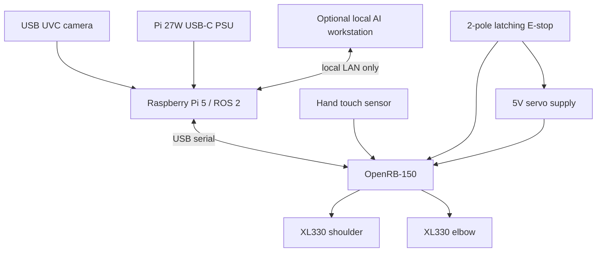

# S1 2-DOF 本地視覺 MVP：採購、接線與 Bring-up

此文件把 ADR-0001～0004 轉成可執行工作包。**目前先作採購規格與設計基線，不代表已下單。**

## 1. 固定架構

Pi 與 servo 使用不同電源。E-stop 的第一組接點硬切 servo power，第二組接點回報狀態；軟體 FET/torque-disable 是第二層保護，不取代硬體斷電。

## 2. 建議 BOM v0.1

| 類別 | 建議品項 | 數量 | 選擇理由 / 驗收 |
|---|---|---:|---|
| Robot host | Raspberry Pi 5 8GB | 1 | ROS/Jazzy、CV、API 與 logging 足夠；不跑大型 VLM |
| Pi power | 官方 27W USB-C PSU | 1 | 5.1V/5A；Pi 5 官方建議 |
| Cooling | Pi 5 Active Cooler 或風扇機殼 | 1 | 長時間 camera/CV workload 不降頻 |
| Storage | 128GB+ A2/high-endurance microSD；USB SSD 可選 | 1 | OS/實驗；重要 rosbag 移到 SSD/工作站 |
| Camera | Logitech C920e/C920s 或同級 UVC 1080p30 | 1 | Ubuntu 24.04/V4L2 簡單、78° FoV、可固定/遮蔽 |
| Actuator | ROBOTIS DYNAMIXEL XL330-M288-T | 2 | 18g、5V、position/current/temp/voltage/error 回授、Bus Watchdog |
| MCU/controller | ROBOTIS OpenRB-150 | 1 | 4 TTL DXL ports、ADC、Arduino、上電 DXL FET 預設 off |
| Servo power | 穩壓 5V、至少 3A、具保護的認證電源 | 1 | OpenRB DXL ports 標示總電流 3A；另加 3A fuse |
| Safety | 2-pole NC、旋轉復歸的 latching E-stop | 1 | 一路切 servo 5V，一路供 MCU state input |
| Protection | 3A fuse/holder、總開關、端子、strain relief | 1 組 | 防短路、接反與拉扯 |
| Touch | FSR + 分壓電阻，或低力 microswitch | 1 | 連 OpenRB ADC/interrupt，提供教學事件 |
| Markers | AprilTag tag36h11，霧面列印 | 3–4 | base/upper/hand ground truth |
| Mechanism | 低重量 3D printed links、底座、螺絲與防滑墊 | 1 組 | upper ≤100mm、forearm ≤80mm、無 payload |
| Camera mount | 小腳架/固定支架 | 1 | calibration 後不能移動 |

### Actuator sizing note

XL330-M288-T 在 5V 的原廠規格為 0.52 N·m stall torque、1.47A stall current；ROBOTIS 商店揭露的估計 rated torque 約 0.10 N·m。設計時以 **0.10 N·m 等級作連續工作上限**，不以 stall torque 設計。

兩顆理論 stall current 合計 2.94A，幾乎等於 OpenRB-150 的 3A DXL port 上限，因此 v0.1 必須：

- 在 actuator control table 設低 current limit，初始每顆不高於 0.45A，完成扭矩/溫升測試後才調整。
- link 短、輕且無 payload；肩關節扭矩試算低於 0.05 N·m 目標。
- software limit 不能取代 3A fuse 與 E-stop。
- 禁止兩軸堵轉；discrepancy/current threshold 立即 controlled stop/torque off。

若肩關節的實測 peak current/溫升過高，不提高 limit 硬撐；改短 link、減重，或另開 ADR 升級肩 actuator/供電。

## 3. 本地 AI/視覺分工

### Pi 必須能獨立完成

- USB camera capture、camera_info/calibration。
- AprilTag/ArUco detection、TF projection、optical-flow correlation。
- ROS 2、self-model registry、skill gateway、event/evidence store。
- 不連外網時完成 E00–E04。

### 本地工作站可選

George 的本地 Mac mini/其他 GPU 工作站可在 LAN 內執行 LLM/VLM、資料分析與訓練。它只透過 self-model API/只讀影像 gateway 工作，不直接連 DXL driver；關掉工作站後 robot 仍可 stop、query 與執行 deterministic grounding。

## 4. 接線基線

### Power domains

- Pi：獨立官方 USB-C PSU。
- OpenRB logic：USB 連 Pi；依 OpenRB jumper/terminal 規範配置。
- DXL：5V servo supply → 3A fuse → latching E-stop NC contact → OpenRB VIN/DXL path。
- 所有 servo power 操作在斷電下完成；XL330 僅允許 3.7–6.0V，推薦 5.0V。

### E-stop state

第二組 NC/NO contact 接到 OpenRB digital input，韌體同時發布 hardware state。E-stop 觸發時：

1. 硬體立即切 DXL supply。
2. MCU 發布 `estop=false/released=false`（若仍有 logic power）。
3. Gateway 取消 execution、拒絕新 motion。
4. 復歸 E-stop 不自動恢復 torque；需重新 health check + explicit enable。

## 5. 機構與相機

- 基座固定於至少 250 × 250 mm 有重量底板；最高點與人臉保持距離。
- 兩軸工作空間以透明罩、桌面標線或 mechanical stop 限定。
- Camera 固定在距離裝置約 0.4–0.8m、完整看見所有 markers 的位置。
- autofocus/exposure 在 calibration 後鎖定（若 camera/driver 支援）。
- 每次移動 camera、link、servo horn 都使 extrinsic/joint-offset evidence 失效。

## 6. Bring-up 順序

### Gate B0 — 不接 servo

- 燒錄 OpenRB firmware；USB heartbeat、E-stop input、touch ADC 正常。
- 斷 USB/程式 crash 後 DXL power FET 保持 off。

### Gate B1 — 單顆 servo、無 link

- 設定唯一 ID、5V、current/velocity/position limits、Bus Watchdog。
- 讀回 model/firmware/position/current/temp/voltage/error。
- 上電 torque disabled；±3° test 後回到 safe pose。

### Gate B2 — 兩顆 servo、無長 link

- Sync read/write，確認 ID 不衝突、topic 不交換、sign 正確。
- 測試 unplug、timeout、E-stop、兩軸資源鎖。

### Gate B3 — 安裝短 link

- 計算並實測 shoulder current/溫升。
- 設 mechanical/software workspace limits。
- 30 分鐘 idle/小動作 soak test。

### Gate B4 — Camera + markers

- 固定相機、calibrate intrinsics/extrinsics。
- 驗證 marker identity、遮擋/stale behavior。
- 完成 E03 視覺定位。

### Gate B5 — Grounding demo

- 加 touch sensor、人類確認與 evidence store。
- 完成 10 次 supervised wiggle，0 false action。
- 封存 v0.1 experiment IDs、revision 與影片/rosbag。

## 7. 採購前不可省略的確認

- [ ] 台灣通路的 XL330-M288-T 是 TTL `-T`、5V M 系列，不是不同電壓/RS-485 版本。
- [ ] OpenRB、servo 接頭與 X3P cables 數量/長度足夠。
- [ ] 5V power supply 在負載端仍不超過 6.0V，極性正確。
- [ ] E-stop 接點有 DC voltage/current rating，且是 latching、可明確復歸。
- [ ] 機構總重、重心距離與肩扭矩完成試算。
- [ ] Camera 可被 Ubuntu/V4L2 辨識並能固定在腳架。
- [ ] 預算保留 15–20% 給線材、端子、備品與重印機構。

## 8. 不採購項目（目前）

Jetson、RGB-D camera、六軸力矩感測器、完整機械臂、夾爪與高扭矩 actuator 全部延後。只有 E05/E08 的量測證據顯示 S1 無法達成下一個能力時才升級。

