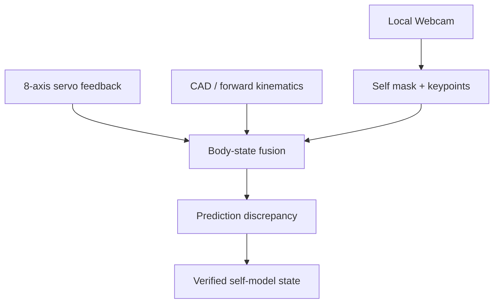

# Project History

本文件記錄會影響 `this-is-yourX` 方向、硬體、模型與驗收方式的重要事件。它是日期化事實紀錄；正式架構規則仍以 README、ADR 與主題文件為準。

## 2026-09-03 — S1 由通用 2-DOF 原型轉向 Amazing Hand

### 摘要

S1 的實體載具由原先提議的 2-DOF 桌上型連桿，轉為已採購的 **Amazing Hand 右手版**。專案仍維持本地相機、本地推論、安全閘道與可驗證 self-model 原則。原 2-DOF 設計保留為低複雜度 fallback，不再是目前主要採購路線。

### 已確認決策

| 項目 | 決策 |
|---|---|
| 第一個實體 embodiment | Amazing Hand，右手、4 指、8-DOF |
| 視覺來源 | 既有本地 USB Webcam，先完成 RGB S1 |
| 運算位置 | 本地開發機；低階安全與馬達控制不可依賴 VLM/LLM |
| S1 主要任務 | 建立伺服狀態、視覺輪廓、關鍵點與因果動作的對應 |
| 深度相機 | S1 暫不採購；需要近距離 3D 抓取時再評估 RealSense D405 |
| 即時視覺主模型 | 自訂 robot-hand keypoint model；快速線使用 YOLO26n-pose |
| 標註輔助 | SAM 3.1 僅作離線遮罩/追蹤與資料標註 |
| 真人手輸入 | MediaPipe Hand Landmarker；只用於示範或模仿控制，不作機器手自我辨識主模型 |

### 採購紀錄

使用者已確認完成下單。本 repo 只保存工程所需品項，不保存姓名、地址、付款資料、訂單編號或其他個資。

| 品項 | SKU | 數量 | 已知單價 |
|---|---|---:|---:|
| Amazing Hand (Right Hand) | 100063642 | 1 | USD 99 |
| Feetech SCS0009 備用伺服 | 100067882 | 2 | USD 9/顆 |

已知購物車商品小計為 **USD 117**，不含運費、進口稅費；實際付款總額未記錄。結帳時右手套件顯示 back order，當時預估出貨日為 **2026-09-30**，實際出貨應以訂單狀態為準。

### 硬體事實與到貨待驗證

Amazing Hand 官方資料描述：

- 4 根手指、8 個自由度，每指以 2 顆 Feetech SCS0009 驅動。
- 可使用 serial bus driver + Python，或 Arduino + Feetech TTL Linker。
- 官方範例可讀取位置、負載/扭矩、溫度等 smart-servo 回授。
- 官方 Demo 已提供 Webcam + MediaPipe 真人右手追蹤控制。

到貨後不得直接執行全幅動作，必須先完成：

1. 拍攝包裝、零件、接頭與損傷狀態。
2. 核對8顆伺服、ID、線材、控制介面與電源配件。
3. 不接負載或使用最小安全姿態，逐顆讀取 model/ID/position/load/temperature。
4. 建立低速度、低行程、溫度與堵轉限制。
5. 驗證通訊中斷、timeout、torque-disable 與實體斷電路徑。
6. 每次只使能一顆伺服，通過後才進入多軸測試。

若套件未包含可由主機使用的 TTL/serial bus adapter、穩壓電源或實體 E-stop，須先補齊再進行實機動作。

## 2026-10-02 — Amazing Hand 右手到貨，開始 bring-up

### 摘要

Amazing Hand 右手套件（Seeed Studio）已到貨。右手的組裝資料、到貨清點、bring-up 工具與逐日紀錄集中在 [`right_hand/`](../right_hand/README.md)，不與之後的其他元件混放。

### 事實

- 變壓器標示 5V 3A。
- 已拍照核對五金、線材、驅動板（`Servo Driver Board for XIAO V1.0`）、分線板與伺服機；結構件尚未核對。詳見 [到貨清點](../right_hand/docs/arrival_inspection.md)。
- 截至 2026-10-03，尚未有任何伺服機上電；沒有 real-hardware validation。
- bring-up 主機使用 macOS；單軸 bring-up 工具 `right_hand/tools/servo_tool.py` 只在假匯流排上測過。

### 待決策

使用者表示之後會加入雙目視覺鏡頭，讓系統看得到這隻右手。型號、基線與校正方式未定。這與上方「視覺來源：既有本地 USB Webcam」「S1 暫不採購深度相機」的決策不同，定案時需另開 ADR。

## S1 視覺與自我模型計畫

### S1 的工程定義

S1 不是讓 VLM 看一張圖片後回答「這是一隻手」，而是建立以下可驗證關係：

> 系統對某一關節提出安全小幅動作，encoder 量到相符變化，影像中特定區域依運動學預期移動；因此該影像區域可被歸因為自身元件。

模型輸出不能直接轉成 raw servo command。所有 motion 必須經過 versioned skill、Safety Gateway、限位、timeout、人工核准與 audit event。

### 資料流



### 建議 body state

```yaml
observed_at: "<monotonic + wall-clock timestamp>"
hardware_revision: "<revision>"
calibration_revision: "<revision>"
model_revision: "<hash>"
servo_position: [0, 0, 0, 0, 0, 0, 0, 0]
servo_load: [0, 0, 0, 0, 0, 0, 0, 0]
servo_temperature: [0, 0, 0, 0, 0, 0, 0, 0]
visual_keypoints:
  - palm_center
  - finger_0_base
  - finger_0_middle
  - finger_0_tip
  - finger_1_base
  - finger_1_middle
  - finger_1_tip
  - finger_2_base
  - finger_2_middle
  - finger_2_tip
  - finger_3_base
  - finger_3_middle
  - finger_3_tip
self_mask_ref: "<derived artifact reference>"
prediction_error: null
quality: "<ok|degraded|stale|unknown>"
```

Voltage/current/speed 欄位只有在 driver 實際提供、單位完成驗證後才加入；不得由型錄能力直接推定實機資料可用。

### 模型選擇

| 層 | S1 選擇 | 備註 |
|---|---|---|
| 人手示範 | MediaPipe Hand Landmarker | 官方 Amazing Hand Demo 的起點；不保證能辨識機器手 |
| 自身關鍵點 | YOLO26n-pose，自訂13點 | 快速建立即時模型；需自有 robot-hand dataset |
| 自身輪廓 | YOLO26n-seg（可選） | 在 keypoint pipeline 穩定後加入 |
| 自動標註教師 | SAM 3.1 | 離線產生/追蹤 mask，人工抽查修正 |
| 因果 grounding | OpenCV motion/optical flow + servo timestamp | 用 wiggle test 建立 joint-to-pixel evidence |
| 3D 深度 | S1 不使用 | RGB 單眼無法可靠提供絕對深度或接觸真值 |

#### 授權注意

Ultralytics YOLO 程式與模型預設受 AGPL-3.0 約束；目前公開實驗 repo 可先用快速線，但若轉為公司內部、閉源或商業系統，必須重新審查授權。較寬鬆的替代方案是 Apache 2.0 的 MMPose/RTMPose，自訂相同13點資料集，但整合成本較高。

### Webcam 最低條件

現有 Webcam 可先使用，前提是實測滿足：

- USB UVC、建議 1080p/30 FPS。
- 固定於剛性支架，距離手約 0.4–0.7m。
- 斜上方約 30–45 度，完整看到手掌及四指。
- 手在工作姿態下占畫面約 40–60%。
- 使用不反光、與手部顏色高對比的背景。
- 以柔和、無明顯閃爍的照明降低反光與 motion blur。
- calibration 後鎖定焦距、曝光與白平衡；若硬體不支援，必須記錄其限制。
- 移動相機、手座、鏡頭焦距或伺服 horn 後，原 calibration evidence 失效。

Webcam 型號尚未記錄；收到型號後再確認視角、固定方式及 driver 控制能力。

### 相機校正

1. 列印霧面 ChArUco board。
2. 取得多角度影像並計算 camera matrix、distortion coefficients。
3. 固定相機後建立 camera-to-hand-base extrinsic。
4. 保存 calibration revision、重投影誤差、影像尺寸與焦距/曝光設定。
5. 每次啟動以固定 tag/board 做快速 sanity check。

### Dataset v0

同步保存：

```text
experiment_id
timestamp_monotonic
timestamp_wall
frame_ref
commanded_position[8]
measured_position[8]
load[8]
temperature[8]
motor_enabled[8]
estop_state
camera_calibration_revision
hardware_revision
software_revision
```

收集策略：

- 第一批2,000–5,000張有效影像。
- 80% train、10% validation、10% test，依 session 分割，避免相鄰 frame 洩漏。
- 每顆關節先做低速、低幅度、單軸 sweep，再做經安全檢查的組合姿態。
- 納入不同光照、背景、少量遮擋及失焦負樣本。
- 初期可貼彩色點或小型 marker 產生 ground truth，成熟後移除。
- 原始影像/rosbag 不直接提交 Git；repo 只保存 metadata、schema、抽樣及可重建腳本。

### 收到設備後的四階段工作

#### Phase A — Hardware bring-up

- 確認8顆 servo identity 與方向。
- 讀取位置/負載/溫度及 freshness。
- 建立 safe pose、角度/速度/溫度/堵轉限制。
- 完成 disconnect、timeout、E-stop、torque-disable 測試。

#### Phase B — Camera baseline

- 固定、校正並鎖定 camera settings。
- 測得 capture FPS、frame timestamp jitter、端到端 latency。
- 跑官方 MediaPipe hand-tracking demo，僅驗證 Webcam pipeline 與示範控制介面。

#### Phase C — Self-vision dataset

- 安全自動掃描姿態並同步記錄 telemetry。
- 以 marker/motion correlation 建立關節及像素的初始對應。
- 使用 SAM 3.1 輔助產生 mask；人工抽查並修正。
- 建立13-point robot-hand keypoint dataset。

#### Phase D — Train and fuse

- 先訓練 keypoint model，再視需要訓練 segmentation model。
- 將視覺 keypoints 與 encoder/FK 預測對齊。
- 計算 prediction discrepancy 並產生 evidence event。
- 只有 deterministic safety controller 可採取 stop/torque-off；VLM/vision model 只提供觀測。

### S1 驗收標準

| 指標 | Gate |
|---|---:|
| Camera capture | 1080p30 或可說明的等效設定 |
| 即時 vision throughput | ≥ 20 FPS |
| Camera-to-state latency | < 100ms（同機本地管線） |
| Keypoint localization | 平均誤差 ≤ 影像對角線1% |
| Visual joint-angle estimate | MAE < 7°，限固定 camera/S1姿態集 |
| Self-mask Region IoU | > 0.90（若啟用 segmentation） |
| Joint-to-region grounding | 每軸10/10 supervised wiggle 正確 |
| Unsafe/ambiguous false action | 0 |
| Occlusion/stale behavior | 降低 confidence 或回報 unknown，不沿用舊結果 |
| Fault handling | vision/driver loss 不影響硬體 stop；1秒內反映 degraded/fault |

上述數值是 S1 初始 gate。首次實測若發現量測噪音或機構限制，必須用 experiment evidence 調整並留下 revision，不可為通過測試而直接放寬。

## 暫不採購與升級條件

S1 暫不需要 Jetson、RGB-D camera 或大型即時 VLM。既有本地開發機可執行資料處理、小型模型訓練與推論；Apple Silicon 可使用 MPS，部署時可評估 Core ML。

只有符合下列情況才升級深度相機：

- 需要可靠的指尖/物體絕對深度。
- 需要6D物體姿態、點雲或3D碰撞檢查。
- 兩根以上手指重疊造成單眼觀測長期不達標。
- 開始未知物體抓取與接觸前預測。

近距離桌面操作優先評估 RealSense D405；原廠標示理想工作距離約7–50cm。採購前仍需在目標 macOS/Linux/ROS環境驗證 SDK、同步、USB頻寬與供貨。

## 建議實作目錄

```text
vision/
├── capture.py
├── calibrate_charuco.py
├── collect_session.py
├── infer_keypoints.py
├── infer_segmentation.py
└── self_state_fusion.py
configs/
├── amazing_hand_right.yaml
├── camera.yaml
└── vision_models.yaml
datasets/
└── README.md
tests/
├── test_timestamp_alignment.py
├── test_stale_frame_rejection.py
├── test_keypoint_contract.py
└── test_vision_disconnect_safe_state.py
```

這是後續實作規劃，不代表上述檔案已完成。

## 下一步

硬體到貨前：

- 收集 Webcam 精確型號與可控參數。
- 準備剛性支架、霧面背景、柔光燈與 ChArUco board。
- 建立 Amazing Hand 8-DOF semantic component IDs 與 fake adapter。
- 準備到貨檢查表及單軸 bring-up script。
- 將原 2-DOF ADR 標為 fallback，另開正式 ADR 固化 Amazing Hand S1。

硬體到貨後：

- 先完成 Phase A，不跳過安全與單軸測試。
- 每次實驗保存 experiment ID、hardware/software/calibration revision。
- 未取得實機證據前，不宣稱通過 real-hardware validation。

## 參考資料

- [Pollen Robotics AmazingHand](https://github.com/pollen-robotics/AmazingHand)
- [AmazingHand Webcam HandTracking Demo](https://github.com/pollen-robotics/AmazingHand/tree/main/Demo/HandTracking)
- [Seeed Studio Amazing Hand Right](https://www.seeedstudio.com/Amazing-Hand-Right-Hand-The-Open-Source-Robotic-Hand-Developer-Kit.html)
- [Google MediaPipe Hand Landmarker](https://developers.google.com/edge/mediapipe/solutions/vision/hand_landmarker/python)
- [Ultralytics YOLO26 supported tasks](https://docs.ultralytics.com/models/yolo26/)
- [Ultralytics licensing](https://www.ultralytics.com/license)
- [MMPose / RTMPose](https://github.com/open-mmlab/mmpose)
- [Meta SAM 3](https://ai.meta.com/blog/segment-anything-model-3/)
- [OpenCV ChArUco calibration](https://docs.opencv.org/4.13.0/da/d13/tutorial_aruco_calibration.html)
- [RealSense D405](https://www.realsenseai.com/)
