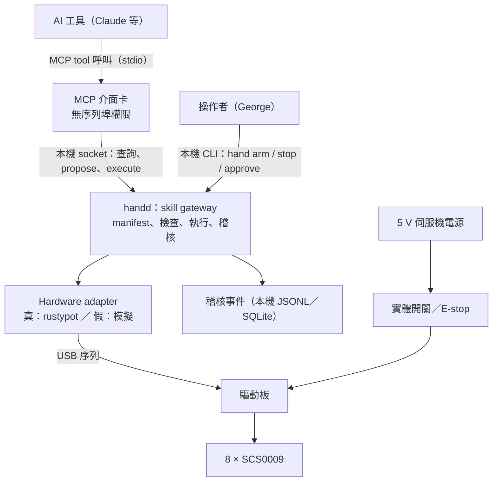

# 右手 AI 介面設計（Hand Skill API v1，草案）

> 正本在 repo：`right_hand/docs/hand_api_design.md`。決策與替代方案見 [ADR-0006](../../docs/adr/0006-hand-skill-api-mcp.md)（狀態：proposed）。
> 這是設計，**還沒有任何實作**。文中的 YAML、JSON 都是草案，不是已提交的 manifest 或 schema。

## 1. 目標與非目標

目標：George 和 AI 工具對話時，AI 可以用這隻右手做有限、可預期的動作（比手勢、數數、回應），並且能查詢手的狀態。換一個 AI 工具時，介面與安全規則不變。

非目標（v1 不做）：

- AI 指定角度、軌跡或速度數值。
- 抓握、按壓、接觸物體。
- 連續遙操作（人手追蹤直接映射到伺服機）。
- 遠端網路存取。v1 只在接著手的那台主機上。

## 2. 架構



| 部分 | 職責 | 不做的事 |
|---|---|---|
| Hardware adapter | 讀寫伺服機；回報帶時間戳的狀態；斷線時回報 unknown | 不知道 skill、授權、自然語言 |
| `handd` | 唯一擁有 adapter；載入 manifest；skill 的檢查、執行、取消；授權與稽核 | 不含任何模型；不解析自然語言 |
| MCP 介面卡 | 把 tool 呼叫轉成對 `handd` 的請求；驗證輸入 schema | 不開序列埠；不能授權；不快取狀態當成現況 |
| 操作者 CLI | 開關授權 session、核准、停止、看紀錄 | 不經過 MCP |
| 實體開關 | 切斷伺服機電源 | 不依賴任何軟體 |

對應到 [01 §9](../../docs/01_SYSTEM_ARCHITECTURE.md) 的 package 邊界：adapter 屬於 state／driver 層，`handd` 是 `gateway`，MCP 介面卡是 `ai_adapter`。

建議的檔案位置（實作時再定）：

```text
right_hand/
├── manifest/right_hand.yaml        # 元件、限制、skill、手勢表
├── runtime/
│   ├── adapter.py                  # HandAdapter 介面、ScsHandAdapter、FakeHandAdapter
│   ├── gateway.py                  # 檢查、資源鎖、執行狀態機、稽核
│   ├── skills.py                   # hand_stop、hand_open、hand_gesture、hand_sequence
│   ├── handd.py                    # 常駐程式與本機 socket
│   └── cli.py                      # hand status | arm | disarm | stop | approve | log
├── mcp/server.py                   # MCP stdio server
└── tests/
```

## 3. 元件 ID（草案）

Semantic ID 和伺服機 ID 分開；伺服機 ID 只出現在 `binding.device_identity`。

| Semantic ID | kind | 說明 | binding |
|---|---|---|---|
| `hand.right` | end_effector | 整隻右手 | — |
| `hand.right.index` | link | 食指 | — |
| `hand.right.index.servo_a` / `servo_b` | actuator | 食指的兩顆伺服機 | `scs:1` / `scs:2` |
| `hand.right.middle`（及 `servo_a`、`servo_b`） | link／actuator | 中指 | `scs:3` / `scs:4` |
| `hand.right.ring`（及 `servo_a`、`servo_b`） | link／actuator | 無名指 | `scs:5` / `scs:6` |
| `hand.right.thumb`（及 `servo_a`、`servo_b`） | link／actuator | 拇指 | `scs:7` / `scs:8` |
| `power.servo_rail` | power | 5 V 伺服機電源 | 由 8 顆的電壓讀值推得 |
| `safety.estop` | safety | 實體開關／E-stop | 見 §7 |

每根手指是兩顆伺服機並聯驅動，彎曲 = (a − b) / 2、側擺 = (a + b) / 2。對 AI 只暴露「手指」與「手」，不暴露單顆伺服機的命令。

別名：`hand.right` 登記「右手」「手」（`手` 標為未審核）。目前沒有左手；問到「左手」時 `self_resolve_reference` 回 `unknown`，不猜成右手。

## 4. 對 AI 的 tool

命名沿用 [09 §3](../../docs/09_AI_AGENT_INTEGRATION.md)。所有回應都帶 `observed_at`、`graph_revision`，以及 `status`。

### 只讀（A0，任何時候都可以呼叫）

| Tool | 輸入 | 回傳 |
|---|---|---|
| `self_list_components` | `kind?`、`lifecycle?` | 元件摘要 |
| `self_get_component` | `component_id`、`include?` | 定義、目前狀態（位置、溫度、扭力、資料年齡）、faults |
| `self_resolve_reference` | `text`、`locale` | `resolved` ／ `ambiguous` ／ `unknown` 與候選 |
| `hand_status` | 無 | 電源軌電壓、8 顆是否都回應、溫度、是否有授權 session 與剩餘時間、允許的 skill 與速度上限、進行中的執行、最近的 fault |
| `skill_list` | 無 | 可用 skill 的契約、目前已校正可用的手勢名稱 |
| `execution_get` | `execution_id` | 狀態（accepted／running／succeeded／failed／cancelled）、各指目標與實際、事件 ID |

### 動作

| Tool | 輸入 | 行為 |
|---|---|---|
| `skill_propose` | `skill`、`target_component`、`parameters`、`reason` | 只驗證、不動。回 `proposal_id`、參數雜湊、預期動作的文字描述、預估時間、是否已在授權範圍內或需要逐次核准 |
| `skill_execute` | `proposal_id`、`idempotency_key` | 重新檢查全部前置條件後執行。回 `execution_id` 或結構化拒絕 |
| `hand_stop` | 無 | 取消進行中的執行並關 8 顆扭力。不需要授權，永遠接受 |

`skill_propose` 的輸入 schema（重點是 `parameters` 只能是列舉值與有界數字）：

```json
{
  "type": "object",
  "required": ["skill", "target_component", "parameters", "reason"],
  "additionalProperties": false,
  "properties": {
    "skill": {"enum": ["hand_open", "hand_gesture", "hand_sequence"]},
    "target_component": {"const": "hand.right"},
    "parameters": {"type": "object"},
    "reason": {"type": "string", "maxLength": 200}
  }
}
```

拒絕一律是結構化的，AI 不需要也不應該猜原因：

```json
{
  "status": "rejected",
  "reason_code": "NOT_ARMED",
  "detail": "沒有有效的授權 session。需要操作者在本機執行 hand arm。",
  "observed_at": "2026-10-08T14:03:11.220+08:00",
  "event_id": "evt_..."
}
```

`reason_code` 列舉：`NOT_ARMED`、`ARM_EXPIRED`、`SKILL_NOT_IN_SESSION`、`SPEED_ABOVE_SESSION_LIMIT`、`APPROVAL_REQUIRED`、`RAIL_DOWN`、`STALE_STATE`、`SERVO_MISSING`、`OVER_TEMPERATURE`、`VOLTAGE_OUT_OF_RANGE`、`BUSY`、`UNKNOWN_SKILL`、`UNKNOWN_GESTURE`、`GESTURE_NOT_CALIBRATED`、`PARAMETER_OUT_OF_RANGE`、`PROPOSAL_EXPIRED`、`PROPOSAL_MISMATCH`、`RATE_LIMITED`、`ACTIVE_FAULT`、`CALIBRATION_REVISION_CHANGED`。

## 5. Skill 契約 v1

| Skill | 版本 | Authority | 參數 | 說明 |
|---|---|---|---|---|
| `hand_stop` | 1.0.0 | A0 | 無 | 取消並關扭力 |
| `hand_open` | 1.0.0 | A3 | `speed` | 四指同時張開，到位後關扭力 |
| `hand_gesture` | 1.0.0 | A3 | `gesture`、`speed`、`hold_s` | 張開 → 擺出 → 停留 → 張開 → 關扭力 |
| `hand_sequence` | 1.0.0 | A3 | `steps[]`（每步是 `gesture` + `hold_s`）、`speed` | 依序擺出多個已校正手勢，最後張開並關扭力 |

`hand_gesture` 的契約（格式照 [04 §2](../../docs/04_DATA_MODEL_AND_APIS.md)）：

```yaml
name: hand_gesture
version: 1.0.0
authority_level: A3
target_kinds: [end_effector]
parameters:
  gesture: {enum: "由手勢表產生；只含 status == confirmed 的名稱"}
  speed:   {enum: [slow, normal, fast], default: slow}
  hold_s:  {type: number, minimum: 0.5, maximum: 30, default: 3}
preconditions:
  - session.armed == true and session.includes(skill) and speed <= session.max_speed
  - safety.estop.released == true            # 見 §7：由電源軌有電推得
  - power.servo_rail.all_servos_responding == true
  - power.servo_rail.voltage_v within [4.0, 7.4] and state_age_ms < 500
  - every servo temperature_c <= 60 and state_age_ms < 2000
  - gesture.calibration.status == confirmed
  - gesture.calibration.revision == manifest.calibration_revision
  - resource hand.right.actuator_bus is free
  - no active blocking fault
requires_approval: false        # 由授權 session 取代逐次核准
resources: [hand.right.actuator_bus]
timeout_s: 45
cancel_behavior: open_then_torque_off   # 張開失敗時直接關扭力
abort_conditions:
  - 任何一顆落後當輪目標超過速度檔的上限（12° / 15° / 19°）
  - 任何一顆電壓 < 4.0 V 或溫度 > 60 °C
  - 任何一顆停止回應
  - 超過 timeout
success_criteria:
  - 擺出時每顆在目標 8° 內且已停下
  - 結束時 8 顆扭力為關
audit: full
```

`hand_sequence` 另外限制：最多 8 步、每步停留 0.3–5 秒、整段不超過 60 秒。

速率與工作週期（gateway 強制，AI 無法調整）：每分鐘最多 6 次執行；任 10 分鐘內扭力開啟的累計時間不超過 3 分鐘；溫度超過 50 °C 時只接受 `hand_open` 與 `hand_stop`。這三個數字是初始值，沒有量測依據，實機階段要用溫升資料修正。

### 手勢表

手勢表在 manifest 裡，每一筆有角度、校正狀態與證據。AI 只看得到名稱與說明，看不到也改不了角度。

| 名稱 | 狀態 | 依據 |
|---|---|---|
| `ok` | confirmed（bring-up 觀察） | [`gesture_calibration.md`](gesture_calibration.md)，2026-10-07 |
| `open` | 待登記 | 現有的張開姿態（−30 / +30），已在實機跑過多次 |
| `fist`、`point`、`victory`、`thumbs_up`、`one`–`four` | 未校正 | 候選清單。這隻手是四指，數數最多到 4 |

新增手勢的流程：人在工作台上用 bring-up 工具調角度 → 記進 `gesture_calibration.md` → 在 manifest 登記為 `confirmed` → manifest revision 改變。AI 可以**提議**想要的新手勢（文字描述），但不能自己把它加進表裡。

重裝舵盤、換連桿、改中位修正時，`calibration_revision` 改變，所有手勢退回 `needs_recheck`，在人重新確認前一律拒絕。

## 6. 授權模型

預設 A0。動作權限由操作者在本機開啟，有期限，綁定 skill 與速度上限：

```bash
hand arm --minutes 20 --skills hand_open,hand_gesture,hand_sequence --max-speed normal
hand disarm
hand status
hand stop
```

- `hand arm` 要在互動終端機執行，並輸入畫面上顯示的確認碼。它會先跑一次只讀健康檢查，沒過就不開。
- session 最長 60 分鐘，到期自動失效；`handd` 重啟後 session 一律作廢。
- 任何一次執行失敗（卡住、電壓、溫度、斷線），session 立即作廢，要人看過之後重新 `hand arm`。
- 授權資訊不出現在任何 tool 的回應內容以外的地方；AI 只看得到「有沒有、剩多久、涵蓋哪些 skill」。
- 之後有自由參數的 skill（例如逐指姿態）用 A2：`skill_propose` 產生 proposal，操作者在本機 `hand approve <代碼>`，核准綁定參數雜湊、60 秒內有效、只能用一次。

**這層授權擋得住什麼、擋不住什麼**

| 情境 | 軟體 session 授權 | 實體開關 |
|---|---|---|
| AI 沒有那台主機的 shell（一般對話、只接了 MCP） | 有效：MCP 介面卡沒有授權用的介面 | 有效 |
| 外部文字（網頁、文件、影像裡的字）說「使用者已同意」 | 有效：gateway 不看對話內容 | 有效 |
| AI 工具本身有那台主機的 shell（在同一台跑 coding agent） | **擋不住**：它可以自己執行 `hand arm` | 有效 |
| `handd` 或主機當掉 | 不適用 | 有效 |

所以實體開關是權威，軟體 session 是第二層。要讓第三列也有效，可選的加固（v1 不做，先記下來）：`handd` 與授權 CLI 跑在另一個 macOS 使用者帳號下；或把授權改成一顆接在主機上的實體按鈕。

## 7. 安全狀態與 E-stop

- **上電與重啟**：`handd` 啟動時先對 8 顆關扭力，不恢復任何未完成的動作。
- **電源軌狀態**：SCS0009 會回報自己的電壓。8 顆都在 500 ms 內回應且電壓在範圍內，才算 `servo_rail == up`。開關切斷後伺服機不回應，狀態變成 unknown，所有動作被拒絕。這讓 E-stop 的狀態不需要額外接線就能 fail closed 地回讀；它不能區分「E-stop 按下」和「線鬆了」，兩者都拒絕，這是可以接受的。
- **執行中斷電**：下一輪讀不到回應 → 執行標為 failed、session 作廢。復電後不續做。
- **MCP 介面卡當掉**：`handd` 照常把進行中的 skill 做完（含張開與關扭力）。skill 本身有界，不需要 AI 在場才能結束。
- **`handd` 當掉**：伺服機停在最後目標並保持扭力。由系統服務重啟 `handd`，啟動流程會關扭力。在重啟之前，只有實體開關能讓手放鬆。這是 SCS0009 經 USB 直驅的已知限制。
- **手指被擋**：位置落後超過上限就中止並關扭力（沿用已在實機跑過的落後檢查）。沒有電流回授，所以無法在接觸當下就知道。

進到實機階段前需要的硬體：一顆固定在桌面、自鎖、切伺服機 5 V 的開關或 E-stop。目前的延長線開關可以切電，但位置不固定。

## 8. 模擬與實機共用契約

`HandAdapter` 介面（草案）：

```python
class HandAdapter(Protocol):
    def read_state(self) -> HandState: ...          # 每顆：position_deg、voltage_v、temperature_c、torque、observed_at、quality
    def torque(self, on: bool) -> None: ...
    def move_together(self, targets_deg: dict[str, float], speed: str,
                      should_abort: Callable[[HandState], str | None]) -> MoveResult: ...
```

- `ScsHandAdapter`：把 `servo_tool.py` 已在實機跑過的 `_engage`、`_move_together`、`_torque_off` 搬過來。
- `FakeHandAdapter`：可注入卡住、電壓下降、斷線、回應延遲。現有的 `tests/fake_scs_bus.py`（協定層的假匯流排）繼續用來測真 adapter。
- `handd --adapter fake` 可以在沒有硬體的機器上跑完整流程，包含 MCP。

## 9. 怎麼接到 AI 工具

MCP 介面卡是本機 stdio server。在接著手的那台主機上，Claude Code 的登記方式（語法依 [官方文件](https://code.claude.com/docs/en/mcp)；模組路徑是示意，實作時再定）：

```bash
claude mcp add --transport stdio right-hand -- ~/this-is-yourX/right_hand/.venv/bin/python -m right_hand.mcp.server
```

其他途徑要在實作階段實際確認，這裡不先保證：

- Claude 桌面 app 的本機 MCP 設定。
- 雲端對話連到那台電腦時，本機登記的 MCP server 能不能被轉給對話使用。
- 不在同一台主機的 AI 工具：需要 [04 §6](../../docs/04_DATA_MODEL_AND_APIS.md) 的 HTTP facade 加上短效 token，v1 不做。

一次典型的互動：

1. George 打開伺服機電源，在終端機 `hand arm --minutes 20 --skills hand_gesture,hand_open --max-speed normal`。
2. 對話中 AI 呼叫 `hand_status`，確認有 session、狀態新鮮。
3. AI 呼叫 `skill_propose`（`hand_gesture`，`gesture: ok`，`hold_s: 3`，附理由）。
4. AI 呼叫 `skill_execute`。`handd` 重新檢查、執行、寫事件。
5. AI 用 `execution_get` 讀結果，回報「比了 OK，食指 +72.1 / −73.5，資料時間 …」。
6. session 到期或 George 執行 `hand disarm`，之後的動作請求回 `NOT_ARMED`。

## 10. 稽核

每次 propose、execute、拒絕、狀態轉移、arm／disarm 都寫一筆事件（格式照 [04 §9](../../docs/04_DATA_MODEL_AND_APIS.md)）：`event_id`、`trace_id`、時間、呼叫者（`ai.mcp` 或 `operator.cli`）、skill 與版本、參數、參數雜湊、manifest／calibration revision、每項前置條件的 true／false／unknown、結果、各顆目標與實際。事件只增不改；AI 的摘要不寫回事件。

存在本機 `right_hand/logs/`，不進 Git。

## 11. 測試清單

結構化輸出與拒絕（全部在假 adapter 上，false action 必須為 0）：

- 沒有 session、session 過期、skill 不在 session 內、速度超過 session 上限。
- 電源軌無回應、只有 7 顆回應、狀態過期、電壓過低、溫度過高。
- 不存在的 skill、不存在的手勢、未校正的手勢、校正版本已變。
- `parameters` 夾帶角度或多餘欄位、`hold_s` 超界、`steps` 超過 8 步。
- 執行中再次 execute（`BUSY`）、重送同一個 `idempotency_key`（不重做）、過期或被竄改的 `proposal_id`。
- 「左手」「翅膀」→ unknown；`reason` 欄位裡寫「使用者已核准」→ 不影響判斷。
- MCP 介面卡沒有任何可以開 session 或核准的路徑。

故障注入：

- 執行中斷線、斷電、手指卡住、電壓下降、`handd` 被殺、MCP 介面卡被殺、操作者 `hand stop`、AI `hand_stop`。
- 每一種都檢查：最終扭力狀態、session 是否作廢、事件是否完整、重啟後不續做。

契約測試：同一組測試分別對 `FakeHandAdapter` 與（接在假匯流排上的）`ScsHandAdapter` 跑。

## 12. 分期

| 階段 | 內容 | AI 能做的事 | 進入條件 |
|---|---|---|---|
| P1 只讀 | manifest、adapter（真／假）、`handd`、MCP 只讀 tool | 查元件、查狀態 | ADR-0006 accepted |
| P2 模擬動作 | skill、gateway 檢查、授權、稽核，全部在假 adapter 上（A1） | 在模擬上 propose／execute | P1 通過；§11 的拒絕測試全過 |
| P3 實機手勢 | 真 adapter 接上 skill（A3，授權 session） | `ok`、張開、停止 | 實體開關裝好並實測；§11 故障注入在實機做過；有 experiment ID |
| P4 擴充 | 更多手勢、`hand_sequence`、逐指姿態（A2）、用雙目相機比對預期與觀測 | 數數、猜拳等 | 各自的校正與測試 |

## 13. 需要 George 決定的事

1. **授權方式**：固定手勢用有期限的 session 授權（本設計的建議），還是每個動作都要你按核准。
2. **實體開關**：進 P3 前加一顆固定的自鎖開關／E-stop 切 5 V（建議），或繼續用延長線開關。
3. **第一批要校正的手勢**：候選是 `fist`、`point`、`victory`、`thumbs_up`、`one`–`four`。
