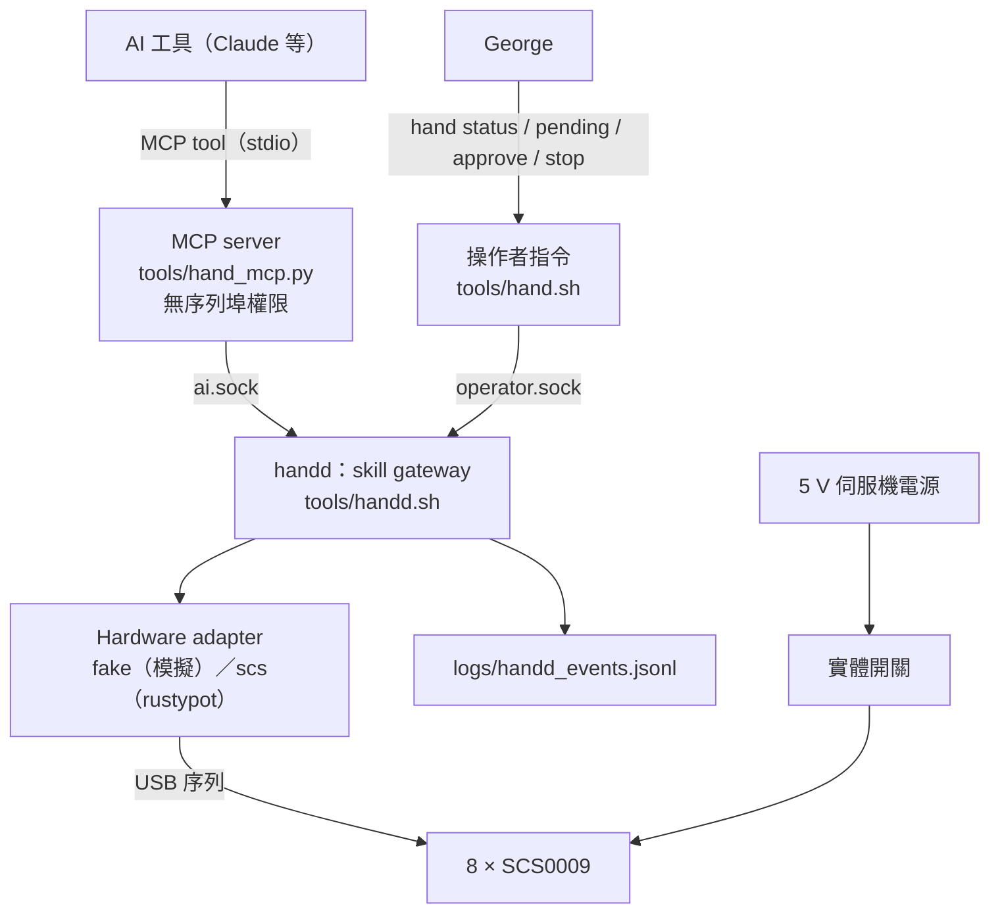

# 右手 AI 介面（Hand Skill API v1）

> 正本在 repo：`right_hand/docs/hand_api_design.md`。決策見 [ADR-0006](../../docs/adr/0006-hand-skill-api-mcp.md)（accepted）。
>
> **狀態（2026-10-08）**：P1（只讀）與 P2（模擬上的提議、核准、執行、稽核）已實作，`pytest right_hand/tests -q` → 148 passed。
> **實機動作尚未開放**：接實體伺服機時只能讀狀態，任何動作請求都回 `REAL_MOTION_NOT_ENABLED`。開放條件見 §12。

## 1. 目標與非目標

目標：George 和 AI 工具對話時，AI 可以用這隻右手做有限、可預期的動作（比已校正的手勢、張開、停止），並查詢手的狀態。換一個 AI 工具時，介面與安全規則不變。

v1 不做：AI 指定角度或軌跡、抓握或接觸物體、連續遙操作、遠端網路存取、手勢序列（`hand_sequence` 延後到 P4）。

## 2. 架構



| 部分 | 檔案 | 職責 | 不做的事 |
|---|---|---|---|
| 設定 | `config/body.yaml`、`calibration.yaml`、`gestures.yaml` | 元件、限制、skill、中位修正、手勢表 | — |
| Hardware adapter | `hand_api/adapter.py` | 讀寫伺服機；回報帶時間戳的狀態；跨程式的匯流排鎖 | 不知道 skill、授權 |
| 移動 | `hand_api/motion.py` | 四指同時移動、落後與電壓檢查、到位確認（移植自已在實機跑過的 `servo_tool.py`） | — |
| Gateway | `hand_api/gateway.py` | 參數驗證、前置條件、逐次核准、執行狀態機、fault、速率限制、稽核 | 不含任何模型 |
| handd | `hand_api/daemon.py` | 獨占 gateway；開 `ai.sock` 與 `operator.sock`，依 socket 決定呼叫者身分 | — |
| 操作者指令 | `hand_api/cli.py` | 核准、停止、清 fault、看紀錄 | 不經過 MCP |
| MCP server | `hand_api/mcp_server.py` | 把 tool 轉成對 `ai.sock` 的請求 | 不開序列埠；沒有核准工具 |

兩個 socket 在 `~/.this-is-yourx/hand/`，目錄 0700、socket 0600。同一個目錄只能跑一個 handd（`handd.lock`）；連線 30 秒沒有請求就斷開。

**匯流排鎖**：handd 的真 adapter 和 `servo_tool.py`（`finger_cal.sh` 等）共用同一個檔案鎖。bring-up 工具在跑時，handd 讀不到狀態（回 `BUS_BUSY`）；handd 正在讀時，bring-up 工具會拒絕開埠。兩邊不會同時寫同一條匯流排。

## 3. 元件 ID

伺服機 ID 只出現在 `binding.device_identity`（`scs:1`…`scs:8`），semantic ID 不含硬體編號。`config/body.yaml` 通過 `schemas/component.schema.json` 0.1.0 驗證，沒有改 schema。

| Semantic ID | kind | 說明 |
|---|---|---|
| `hand.right` | end_effector | 整隻右手；別名「右手」（審核過）、「手」（未審核） |
| `hand.right.index` / `middle` / `ring` / `thumb` | link | 四根手指 |
| `hand.right.<finger>.servo_a` / `servo_b` | actuator | 每根手指的兩顆伺服機（食指 1/2、中指 3/4、無名指 5/6、拇指 7/8） |
| `power.servo_rail` | power | 5 V 電源軌；由 8 顆的回應與電壓推得 |
| `safety.estop` | safety | 手動電源開關；沒有回讀線路，狀態一律 unknown |

彎曲 = (a − b) / 2、側擺 = (a + b) / 2，扣掉中位修正後計算。

## 4. 對 AI 的 tool

| Tool | 種類 | 輸入 | 說明 |
|---|---|---|---|
| `hand_status` | 只讀 | — | 每顆位置／電壓／溫度／扭力、讀值時間與資料年齡、各指彎曲與側擺、電源軌、是否模擬、進行中的執行、fault、待核准數 |
| `self_list_components` | 只讀 | `kind?` | 元件清單 |
| `self_get_component` | 只讀 | `component_id`、`include?` | 定義與目前狀態 |
| `self_resolve_reference` | 只讀 | `text`、`locale?` | `resolved` ／ `ambiguous` ／ `unknown` |
| `skill_list` | 只讀 | — | 可提議的 skill、參數範圍、可用手勢名稱（不含角度） |
| `skill_propose` | 動作 | `skill`、`reason`、`gesture?`、`speed`、`hold_s`、`target_component` | 只驗證、不動；回 `proposal_id` |
| `skill_execute` | 動作 | `proposal_id`、`idempotency_key` | 只對已核准的提議有效 |
| `execution_get` | 只讀 | `execution_id` | accepted／running／succeeded／failed／cancelled，各階段每顆的目標與實際 |
| `hand_stop` | 停止 | — | 取消並關扭力；不需要核准 |

沒有任何 tool 的參數是角度、位置或核准憑證；MCP 層會丟掉多餘的參數，gateway 對多餘參數回 `PARAMETER_NOT_ALLOWED`。

所有回應都有 `status`、`observed_at`、`graph_revision`；拒絕時另有 `reason_code`、`detail`、`event_id`。`reason_code` 一覽：

- 提議：`UNKNOWN_SKILL`、`UNKNOWN_COMPONENT`、`WRONG_TARGET`、`PARAMETER_NOT_ALLOWED`、`PARAMETER_OUT_OF_RANGE`、`UNKNOWN_GESTURE`、`GESTURE_NOT_CALIBRATED`、`CALIBRATION_REVISION_CHANGED`
- 核准：`NOT_PERMITTED`、`UNKNOWN_PROPOSAL`、`PROPOSAL_USED`、`PROPOSAL_EXPIRED`
- 執行：`APPROVAL_REQUIRED`、`APPROVAL_EXPIRED`、`PROPOSAL_MISMATCH`、`IDEMPOTENCY_CONFLICT`、`REAL_MOTION_NOT_ENABLED`、`ACTIVE_FAULT`、`BUSY`、`RATE_LIMITED`、`BUS_BUSY`、`PORT_UNAVAILABLE`、`RAIL_DOWN`、`SERVO_MISSING`、`STALE_STATE`、`STATE_UNKNOWN`（讀值不是有限數字）、`VOLTAGE_OUT_OF_RANGE`、`OVER_TEMPERATURE`、`STOPPED`（檢查期間收到停止）
- 執行中失敗：`LAG_EXCEEDED`、`VOLTAGE_SAG`、`SERVO_LOST`、`NOT_SETTLED`、`TORQUE_OFF_FAILED`、`INTERNAL_ERROR`；取消為 `CANCELLED`
- 連線：`HANDD_UNAVAILABLE`（MCP server 連不到 handd）、`METHOD_NOT_ALLOWED`（socket 不提供該方法）

## 5. Skill

| Skill | 版本 | Authority | 參數 | 動作 |
|---|---|---|---|---|
| `hand_stop` | 1.0.0 | A0 | — | 取消並關扭力 |
| `hand_open` | 1.0.0 | A2 | `speed` | 四指同時張開，到位後關扭力 |
| `hand_gesture` | 1.0.0 | A2 | `gesture`、`speed`（slow／normal／fast）、`hold_s`（0.5–30 秒） | 張開 → 四指同時擺出 → 停留 → 張開 → 關扭力 |

執行時的前置條件（任何一項是 false 或 unknown 都拒絕，且不寫出任何目標位置）：

1. 提議存在、未過期（120 秒）、未用過；已核准、核准未過期（60 秒）、核准的參數雜湊與提議一致。
2. 不是真硬體（P2）；沒有 fault；沒有進行中的執行；一分鐘內不超過 6 次。
3. 當下重新讀 8 顆：全部回應、讀值不超過 500 ms、電壓 4.0–7.4 V、溫度 ≤ 60 °C。
4. 手勢的 `status` 是 `confirmed`，且 `calibration_revision` 等於目前的校正版本。
5. 每顆目標含中位修正在 ±95° 以內（提議時就檢查）。

執行中的中止條件沿用實機版：任何一顆落後當輪目標超過速度檔上限（12° / 15° / 19°）、電壓 < 4.0 V、停止回應、到位確認沒過（8° 內且停下）。中止後一律關扭力，並鎖住 fault；之後的動作都回 `ACTIVE_FAULT`，直到 George 看過後 `hand clear-fault`。被 `hand_stop` 取消不算 fault。

### 手勢表

`config/gestures.yaml`。AI 只看得到名稱、標籤、說明。

| 名稱 | 狀態 | 依據 |
|---|---|---|
| `ok` | confirmed（bring-up 觀察） | [`gesture_calibration.md`](gesture_calibration.md)，2026-10-07；角度與 `servo_tool.py` 的表相同（有測試確認） |

新增手勢：人在工作台上用 bring-up 工具調角度 → 記進 `gesture_calibration.md` → 在 `gestures.yaml` 登記為 `confirmed` → 重啟 handd。AI 可以用文字提議想要的手勢，但不能把它加進表裡。重裝舵盤或改中位修正時要改 `calibration.yaml` 的 `revision`，所有手勢會被拒絕，直到重新確認。

## 6. 核准（逐次，A2）

2026-10-08 George 決定：每個動作都要他核准。流程：

1. AI 呼叫 `skill_propose`，拿到 `proposal_id`，並請 George 核准。
2. George 在接著手的電腦上：

   ```bash
   bash ~/this-is-yourX/right_hand/tools/hand.sh pending          # 看內容
   bash ~/this-is-yourX/right_hand/tools/hand.sh approve prop_xxxx # 在終端機輸入 y
   ```

3. 60 秒內 AI 呼叫 `skill_execute`。核准只能用一次。

`hand approve` 只接受互動終端機的輸入，不接受管線或腳本。

**擋得住什麼、擋不住什麼**

| 情境 | 逐次核准 | 實體開關 |
|---|---|---|
| AI 沒有那台主機的 shell（一般對話、只接了 MCP） | 有效：MCP 與 `ai.sock` 都沒有核准的方法 | 有效 |
| 文件、網頁、影像或 `reason` 欄位裡寫「已核准」 | 有效：gateway 不看文字內容 | 有效 |
| AI 工具本身有那台主機的 shell | **擋不住**：它可以連 `operator.sock` 或執行 `hand approve` | 有效 |
| handd 或主機當掉 | 不適用 | 有效 |

實體開關是權威，軟體核准是第二層。加固選項（未做）：handd 與 `hand` 跑在另一個 macOS 帳號下；或核准改成接在主機上的實體按鈕。

## 7. 安全狀態

- **handd 啟動**（真 adapter）：先對 8 顆送關扭力，結果照實印出。
- **handd 結束**（Ctrl-C、SIGTERM）：取消進行中的執行、關扭力、刪掉 socket。
- **執行結束**：不論成功、失敗或取消，都對 8 顆送關扭力；關不掉的 ID 記在 `torque_off_failed`。
- **執行中斷電或斷線**：該輪讀不到 → `SERVO_LOST`、fault 鎖住。復電後不續做。
- **MCP server 當掉**：handd 照常把進行中的 skill 做完並關扭力。
- **handd 當掉**：伺服機停在最後目標並保持扭力；只有實體開關能讓手放鬆。這是 SCS0009 經 USB 直驅、沒有 MCU watchdog 的已知限制。
- **電源軌狀態**：開關切斷時伺服機不回應，`rail_up` 變成 unknown，動作被拒絕。無法區分「開關切斷」和「線鬆了」，兩者都拒絕。

## 8. 模擬與實機

`FakeHandAdapter` 與 `ScsHandAdapter` 實作同一組基本操作，`motion.py` 與 gateway 兩邊共用。測試裡真 adapter 接在 `tests/fake_scs_bus.py`（協定層的假匯流排）上跑同一段移動程式。

模擬的限制：有扭力時目標一寫入就到位，沒有速度、慣性或接觸。模擬成功只代表流程、檢查與核准正確，不代表實機姿態正確。

## 9. 安裝與接上 AI 工具（Mac mini）

```bash
cd ~/this-is-yourX && git pull
right_hand/.venv/bin/pip install -r right_hand/requirements.txt
bash right_hand/tools/handd.sh                  # 模擬；終端機保持開著
# 或：bash right_hand/tools/handd.sh --adapter scs   # 接實體，只讀
```

登記 MCP server（兩種擇一）：

- **Claude 桌面 app**：設定裡的開發者選項開啟設定檔，在 `mcpServers` 加一項後重開 app：

  ```json
  {
    "mcpServers": {
      "right-hand": {
        "command": "/Users/georgechen/this-is-yourX/right_hand/.venv/bin/python",
        "args": ["/Users/georgechen/this-is-yourX/right_hand/tools/hand_mcp.py"]
      }
    }
  }
  ```

- **Claude Code**（語法依[官方文件](https://code.claude.com/docs/en/mcp)）：

  ```bash
  claude mcp add --transport stdio right-hand -- ~/this-is-yourX/right_hand/.venv/bin/python ~/this-is-yourX/right_hand/tools/hand_mcp.py
  ```

handd 沒開時，tool 會回 `HANDD_UNAVAILABLE`，不會出錯當掉。

## 10. 稽核

`right_hand/logs/handd_events.jsonl`，只增不改，不進 Git。事件：`handd.started`、`proposal.created`、`proposal.rejected`、`approval.granted`、`approval.rejected`、`execution.rejected`、`execution.accepted`、`execution.running`、`execution.finished`、`stop`、`fault.cleared`、`handd.stopped`。每筆有 `event_id`、`trace_id`（= `proposal_id`）、時間、呼叫者、內容；執行事件帶參數雜湊、核准者、校正版本、各階段每顆的目標與實際。

`hand log 30` 可以看最近 30 筆。

## 11. 測試

`right_hand/tests/test_hand_api.py`（79 項）＋原有的 `test_servo_tool.py`（69 項）。重點是 false action = 0：每個拒絕案例都檢查沒有寫出任何目標位置。

- 設定：manifest 通過 repo schema；手勢角度、速度檔、張開角度、到位容許與 `servo_tool.py` 一致；匯流排鎖路徑一致；超界或缺指的手勢表被拒絕。
- 核准：未核准、核准過期、提議過期、核准重複使用、AI 身分核准或清 fault、`reason` 裡寫「已核准」、偽造的 `proposal_id`、idempotency 重送與衝突。
- 參數：夾帶角度或姿態、未知手勢、`hold_s` 超界／布林／NaN／字串、未知速度、左手、手指當目標、未知 skill。
- 前置條件：8 顆都不回應、少 1 顆、資料過期、電壓過低／過高、溫度過高、匯流排被占用、真硬體（P2）、速率限制、校正版本改變。
- 執行中：手指卡住（含 fault 鎖住與清除）、電壓掉落、掉一顆、停留時 `hand_stop`、另一個執行進行中。
- daemon：socket 權限、角色分流、亂碼請求、handd 沒開；CLI 拒絕非互動輸入的核准。
- MCP：工具清單沒有核准工具、沒有角度參數；完整流程（提議 → 未核准被拒 → 操作者核准 → 模擬執行成功）；handd 沒開時回結構化錯誤。
- 真 adapter：在假匯流排上讀狀態、走同一段移動程式、回報掉線、和 bring-up 工具互斥。

- 審查後補的回歸測試：檢查期間收到停止、執行緒起不來、稽核寫入失敗（受理時與執行中）、NaN／None／inf 讀值、非有限的中位修正、同一目錄第二個 handd、`cu.`／`tty.` 同一裝置的鎖、到位確認時取消。這 7 個情境在修正前的程式上都會失敗。

另外在開發機上以真實程序跑過一次端到端：handd（模擬）＋ `tools/hand_mcp.py`（stdio）＋ 操作者 socket 核准 → 執行 succeeded。

故障注入中「執行中殺掉 handd」只做了文件上的分析（§7），沒有自動化測試。

## 12. 分期

| 階段 | 內容 | 狀態 |
|---|---|---|
| P1 只讀 | manifest、adapter、handd、MCP 只讀 tool | 完成（2026-10-08），尚未在 Mac mini 上實測 |
| P2 模擬動作 | 提議、逐次核准、執行、fault、稽核，全部在模擬上 | 完成（2026-10-08），尚未在 Mac mini 上實測 |
| P3 實機手勢 | 對真 adapter 開放 `hand_gesture`／`hand_open` | 未開始。條件：固定的實體開關裝好並實測；§11 的故障注入在實機上做過（含拔 USB、切電源、殺 handd）；有 experiment ID |
| P4 擴充 | 更多手勢、`hand_sequence`、逐指姿態、用雙目相機比對預期與觀測 | 未開始 |

## 13. 決策紀錄

- 2026-10-08：授權採逐次核准（A2），不採有期限的 session（A3）。George 決定。
- 2026-10-08：先做 P1＋P2。George 決定。
- 未決：P3 前是否加固定的實體開關／E-stop；第一批要校正的手勢（候選 `fist`、`point`、`victory`、`thumbs_up`、`one`–`four`）。
